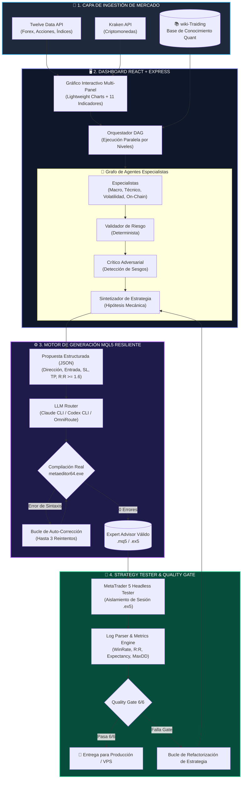

<div align="center">

# ⚡ MetaTrader_Bots
### *Ecosistema Multiagente de IA para Investigación Cuantitativa, Generación Autónoma de Expert Advisors MQL5 y Validación de Estrategias en MetaTrader 5*

<p align="center">
  <a href="https://github.com/Zambudio/MetaTrader_Bots/stargazers"></a>
  <a href="https://trading.buenchollotech.com"></a>
  <a href="#-estado-actual-del-proyecto-agosto-2026"></a>
  <a href="#-puesta-en-marcha-y-desarrollo-local"></a>
  <a href="https://www.metatrader5.com/"></a>
  <a href="LICENSE"></a>
</p>

<p align="center">
  
</p>

<br/>

[🚀 Ver Dashboard en Producción](https://trading.buenchollotech.com) •
[📊 Baselines Validados](#-estado-actual-del-proyecto-agosto-2026) •
[📖 Wiki Cuantitativa](wiki-Traiding/index.md) •
[🤖 Consola de Agentes](trading-agents-dashboard/README.md) •
[🛡️ Estándar MQL5 (22 Reglas)](wiki-Traiding/proyecto-mt5-bots/17_Estandar_Desarrollo_EAs_con_IA.md) •
[🧪 Informes de Auditoría](wiki-Traiding/proyecto-dashboard/00_INDEX.md)

---

</div>

## 📌 Tabla de Contenidos

- [🎯 Filosofía de Diseño: IA vs. Ejecución](#-filosofía-de-diseño-ia-vs-ejecución)
- [📊 Estado Actual del Proyecto (Agosto 2026)](#-estado-actual-del-proyecto-agosto-2026)
- [✨ Capacidades Principales del Ecosistema](#-capacidades-principales-del-ecosistema)
- [🏗️ Arquitectura Integral y Flujo de Datos](#️-arquitectura-integral-y-flujo-de-datos)
- [🧩 Componentes del Sistema](#-componentes-del-sistema)
  - [1. Trading Agents Dashboard (`trading-agents-dashboard/`)](#1-trading-agents-dashboard-trading-agents-dashboard)
  - [2. Enrutador Multimodelo y Conexión CLI de Suscripción](#2-enrutador-multimodelo-y-conexión-cli-de-suscripción)
  - [3. Pipeline MQL5 Resiliente y Auto-Sanación de Compilación](#3-pipeline-mql5-resiliente-y-auto-sanación-de-compilación)
  - [4. Quality Gate y Analizador de Logs del Strategy Tester](#4-quality-gate-y-analizador-de-logs-del-strategy-tester)
  - [5. Base de Conocimiento Cuantitativo (`wiki-Traiding/`)](#5-base-de-conocimiento-cuantitativo-wiki-traiding)
- [🛡️ Estándar de Seguridad Institucional MQL5 (22 Reglas)](#️-estándar-de-seguridad-institucional-mql5-22-reglas)
- [📁 Estructura del Monorepo](#-estructura-del-monorepo)
- [🚀 Puesta en Marcha y Desarrollo Local](#-puesta-en-marcha-y-desarrollo-local)
- [🌐 Despliegue en Producción 24/7](#-despliegue-en-producción-247)
- [📄 Licencia y Autoría](#-licencia-y-autoría)

---

## 🎯 Filosofía de Diseño: IA vs. Ejecución

> [!IMPORTANT]
> **Principio de Aislamiento Determinista:**  
> Los Modelos de Lenguaje (LLMs) y los Agentes de IA son **motores de investigación, diseño conceptual y síntesis analítica**, jamás el motor de ejecución en vivo.
> 
> - **Capa de Investigación (IA Multiagente):** Analiza regímenes de mercado, correlaciones macro, confluencias técnicas y formula hipótesis mecánicas estructuradas codificadas en MQL5.
> - **Capa de Ejecución (MQL5 Nativo en MT5):** Se ejecuta en MetaTrader 5 / VPS a nivel sub-milisegundo, de forma **100% determinista**, con Stop Loss inmutable en broker y **cero latencia o riesgo de alucinación de la IA**.

```
┌────────────────────────────────────────────────────────────────────────┐
│                      CAPA DE INVESTIGACIÓN (IA)                        │
│   Twelve Data / Kraken ──► DAG Multiagente ──► Wiki Cuantitativa       │
│            ▼                                                           │
│   Hipótesis Estructurada (JSON) ──► Generador MQL5 (.mq5)              │
└───────────────────────────────────┬────────────────────────────────────┘
                                    │ Compilación Headless & Auto-Fix
┌───────────────────────────────────▼────────────────────────────────────┐
│                    CAPA DE EJECUCIÓN (METATRADER 5)                    │
│   MetaEditor (CLI) ──► Strategy Tester (Headless) ──► Quality Gate     │
│   * Ejecución nativa determinista, SL obligatorio, 0 latencia LLM *    │
└────────────────────────────────────────────────────────────────────────┘
```

---

## 📊 Estado Actual del Proyecto (Agosto 2026)

El sistema ha superado con éxito la fase de **Baseline Funcional Validada**, con el ciclo completo operativo de extremo a extremo: **Análisis Multiagente → Veredicto GO → Generación MQL5 → Compilación Real → Backtest Headless → Quality Gate 6/6**.

### 1. Baselines por Mercado Validados

Se han diseñado, testeado y congelado tres configuraciones especializadas por mercado, con contratos estructurados que separan **DATO (con fuente exacta), INFERENCIA, HIPÓTESIS y CONCLUSIÓN**:

| Mercado | Preset | Activo de Prueba | Estado | Success Rate | Roles Activos |
|---|---|---|:---:|:---:|---|
| **Forex** | `forex_v1` | **EUR/USD** (H1) | `VALIDATED` 🟢 | **100%** (6/6 runs) | Macro/Divisas, Técnico, Régimen, Validador, Crítico, Síntesis |
| **Acciones** | `stocks_v1` | **TSLA** (H4) | `VALIDATED` 🟢 | **100%** (5/5 runs) | Fundamentales/SEC, Técnico, Momentum, Validador, Crítico, Síntesis |
| **Cripto** | `crypto_v1` | **BTC/USD** (H1) | `VALIDATED` 🟢 | **100%** (5/5 runs) | On-Chain/Derivados, Técnico, Volatilidad, Validador, Crítico, Síntesis |

> `VALIDATED` certifica la integridad funcional del pipeline y de los contratos en simulación. No implica autorización para capital real ni garantía de Sharpe positivo.

### 2. Hitos Recientes de Ingeniería

- ✅ **Resiliencia Total en Generación MQL5:** Persistencia de jobs en disco y estado. Los procesos de generación y compilación sobreviven a reinicios del servidor (`pm2 restart`), actualizaciones de código y cortes transitorios (`502`/`504`) del túnel de Cloudflare.
- ✅ **Detección Limpia de MetaTrader 5 Abierto:** El backtester headless detecta si existe una instancia GUI de MT5 en ejecución y aborta de inmediato con mensaje descriptivo, evitando cuelgues de 180s debidos al comportamiento single-instance de Windows en `terminal64.exe`.
- ✅ **Enrutador Multimodelo por CLI de Suscripción:** Selector en cascada **Fuente → Modelo → Esfuerzo de Razonamiento** para cada agente y para el generador MQL5, permitiendo usar Claude Code CLI y OpenAI Codex CLI de suscripción sin costes de tokens API por uso.
- ✅ **Ejecución Paralela por Niveles DAG:** Los agentes que residen en el mismo estrato del grafo de dependencias se ejecutan en paralelo con `Promise.all`, reduciendo el tiempo de análisis hasta un 65%.
- ✅ **Quality Gate 6/6 Automatizado:** Primera estrategia generada por IA en EUR/USD H1 que supera el Quality Gate estricto en backtest real (`2025.08.01`–`2026.08.18`, every tick) con Win Rate 44.4%, R:R real 1.60, Profit Factor 1.256 y cero órdenes rechazadas.

---

## ✨ Capacidades Principales del Ecosistema

<table>
  <tr>
    <td width="50%">
      <h3>🧠 Orquestador Multiagente DAG</h3>
      <ul>
        <li>Grafo visual interactivo con dependencias multi-padre y detección matemática de ciclos.</li>
        <li>Ejecución en capas paralelas por niveles topológicos.</li>
        <li>Rosters modulares con especialistas, sintetizador, validador de riesgo, crítico adversarial y juez.</li>
        <li>Reglas de abstención trazables cuando faltan datos obligatorios.</li>
      </ul>
    </td>
    <td width="50%">
      <h3>⚡ Generador MQL5 con Auto-Sanación</h3>
      <ul>
        <li>Generación de Expert Advisors conformes a las 22 reglas institucionales del proyecto.</li>
        <li>Compilación nativa desatendida mediante <code>metaeditor64.exe</code>.</li>
        <li>Bucle de auto-corrección de errores de sintaxis/lógica (hasta 3 reintentos) con base de datos de lecciones aprendidas.</li>
        <li>Selector independiente de motor LLM para codegen.</li>
      </ul>
    </td>
  </tr>
  <tr>
    <td width="50%">
      <h3>🧪 Backtest Headless & Quality Gate</h3>
      <ul>
        <li>Lanzamiento headless del Strategy Tester de MT5 con generación dinámica de configuraciones <code>.ini</code>.</li>
        <li>Correlación estricta de sesión mediante hash único de compilación <code>.ex5</code>.</li>
        <li>Parser de logs crudos UTF-16LE con cálculo de Win Rate, R:R real, Esperanza (R), Profit Factor, Drawdown y Balance neto.</li>
      </ul>
    </td>
    <td width="50%">
      <h3>📚 Wiki Cuantitativa (Karpathy LLM Pattern)</h3>
      <ul>
        <li>Más de 40 papers y guías de investigación quant rigurosas (Black-Scholes, Almgren-Chriss, Ralph Vince Optimal f, Cointegración).</li>
        <li>Inyección automática de contexto hacia los agentes en función del activo y los indicadores analizados.</li>
        <li>Cero documentos huérfanos; catálogo completamente indexado y navegable.</li>
      </ul>
    </td>
  </tr>
  <tr>
    <td width="50%">
      <h3>📈 Gráficos Pro con Multi-Panel</h3>
      <ul>
        <li>Renderizado ultrarrápido con <code>lightweight-charts</code> y soporte para 11 indicadores técnicos en paneles separados.</li>
        <li>Buscador universal estilo TradingView (Forex, Acciones, Cripto, Índices, Fondos) con almacenamiento de favoritos.</li>
      </ul>
    </td>
    <td width="50%">
      <h3>🌐 Infraestructura 24/7 Always-On</h3>
      <ul>
        <li>Despliegue autónomo en NAS/PC bajo <b>PM2</b> con arranque silencioso en el login (sin parpadeos de consola).</li>
        <li>Túnel seguro con <b>Cloudflare Tunnel</b> publicado en <code>trading.buenchollotech.com</code> sin apertura de puertos.</li>
      </ul>
    </td>
  </tr>
</table>

---

## 🏗️ Arquitectura Integral y Flujo de Datos



---

## 🧩 Componentes del Sistema

### 1. Trading Agents Dashboard (`trading-agents-dashboard/`)
Consola web de última generación construida con **React 19**, **TypeScript**, **Tailwind CSS v4** y **Zustand**.
- **Gestión Visual del Grafo de Agentes:** Enlace de agentes arrastrando tarjetas o mediante selectores matriciales, calculando niveles de ejecución en paralelo.
- **Buscador de Activos con Filtro Inteligente:** Clasificación por Todos, Acciones, Fondos, Forex, Cripto e Índices, con favoritos persistentes.
- **Gráficos Multi-Panel:** Renderizado de velas OHLC, medias móviles (SMA/EMA), Bandas de Bollinger, RSI, MACD, Estocástico, ATR y Volumen.
- **Visor y Editor de Código MQL5:** Interfaz integrada para revisar el código `.mq5` generado, consultar logs de compilación de MetaEditor y descargar el bot listo para operar.

### 2. Enrutador Multimodelo y Conexión CLI de Suscripción
El sistema incluye un router extensible (`server/src/engine/llmRouter.ts`) que permite seleccionar diferentes motores por agente y para MQL5:
- **Claude Code CLI (`claude`):** Conexión por subprocess nativo a `claude.exe` con modelos `sonnet`, `opus`, `haiku`.
- **OpenAI Codex CLI (`openai`):** Ejecución con modelos `gpt-5.6-sol`, `gpt-5.1-codex-max`, `codex-mini` con selección de esfuerzo de razonamiento (`low`, `medium`, `high`).
- **OmniRoute Gateway (`omniroute`):** Conexión HTTP al gateway self-hosted en NAS (`192.168.1.3:20128`) con cadena de fallback automática.
- **Modo Simulado (`mockExecutor`):** Permite testear el flujo completo sin coste de tokens.

### 3. Pipeline MQL5 Resiliente y Auto-Sanación de Compilación
Transforma la propuesta estructurada en un Expert Advisor robusto:
1. **Inyección del Estándar:** Aplica las directivas obligatorias de [`17_Estandar_Desarrollo_EAs_con_IA.md`](wiki-Traiding/proyecto-mt5-bots/17_Estandar_Desarrollo_EAs_con_IA.md).
2. **Compilación Headless:** Llama a `metaeditor64.exe /compile` en segundo plano.
3. **Memoria de Errores Persistente:** Registra las incidencias corregidas en [`MQL5_ERRORES_CONOCIDOS.md`](trading-agents-dashboard/docs/MQL5_ERRORES_CONOCIDOS.md).
4. **Persistencia de Jobs:** Si el servidor se reinicia o el túnel falla, el estado de la generación se conserva en disco (`server/src/data/mql5Jobs.json`).

### 4. Quality Gate y Analizador de Logs del Strategy Tester
Evalúa el rendimiento de los backtests con métricas matemáticas objetivas:

| Criterio del Quality Gate | Umbral Mínimo | Objetivo | Estado Objetivo |
|---|---|---|:---:|
| **Operaciones Cerradas** | $\ge 15$ trades | Muestra estadística mínima | `PASS` ✅ |
| **Órdenes Rechazadas** | $0$ errores | Integridad operativa total | `PASS` ✅ |
| **Esperanza Matemática** | $> 0.10\text{ R}$ | Edge estadístico positivo | `PASS` ✅ |
| **Profit Factor** | $\ge 1.20$ | Relación beneficio/pérdida sólida | `PASS` ✅ |
| **Beneficio Neto** | $> 0\text{ USD}$ | Crecimiento de capital | `PASS` ✅ |
| **Drawdown Máximo** | $\le 15.0\%$ | Preservación de capital | `PASS` ✅ |

### 5. Base de Conocimiento Cuantitativo (`wiki-Traiding/`)
Base de conocimiento viva bajo la metodología **Karpathy LLM Wiki Pattern**:
- **Microestructura de Mercado:** Modelos Almgren-Chriss (2000), dinámica de Order Book y slippage.
- **Gestión de Riesgo:** Criterio de Kelly, Optimal $f$ de Ralph Vince, Conditional Expected Drawdown y simulaciones Monte Carlo.
- **Estrategias Cuantitativas:** Pairs Trading cointegrado, Momentum cross-sectional (Jegadeesh & Titman), Trend Following multi-activo.

---

## 🛡️ Estándar de Seguridad Institucional MQL5 (22 Reglas)

Todos los Expert Advisors generados cumplen de forma estricta el estándar del proyecto:

| Regla | Requisito Técnico | Propósito |
|---|---|---|
| **R01 - Stop Loss Obligatorio** | Stop Loss explícito incluido en la orden de apertura (`trade.Buy` / `trade.Sell`). | Previene liquidación de cuenta ante desconexiones o gaps de mercado. |
| **R02 - Magic Number Único** | Identificador `ulong` exclusivo para cada par y estrategia. | Evita colisión de órdenes entre diferentes robots simultáneos. |
| **R03 - Control de Spread y Slippage** | Comprobación de spread máximo antes de enviar cualquier deal. | Protege contra aperturas en periodos de baja liquidez o rollover. |
| **R04 - Liberación de Handles** | Invocación obligatoria de `IndicatorRelease()` en `OnDeinit()`. | Elimina fugas de memoria en el terminal de MetaTrader. |
| **R05 - Saneamiento de Lotes** | Normalización de volumen vía `SYMBOL_VOLUME_STEP` y `SYMBOL_VOLUME_MIN/MAX`. | Evita rechazos `TRADE_RETCODE_INVALID_VOLUME`. |
| **R06 - Cierre de Barra Estricto** | Evaluación de señales exclusivamente en barra cerrada (`iClose(..., 1)`). | Elimina señales fantasma dentro de la barra en formación. |

<details>
<summary><b>📖 Ver desglose completo de las 22 reglas institucionales</b></summary>

Consulte el documento maestro de arquitectura: [`wiki-Traiding/proyecto-mt5-bots/17_Estandar_Desarrollo_EAs_con_IA.md`](wiki-Traiding/proyecto-mt5-bots/17_Estandar_Desarrollo_EAs_con_IA.md) para conocer las directivas sobre:
- Inicialización de buffers e indicadores en `OnInit()`.
- Verificación de tipos de ejecución de cuenta (Netting vs. Hedging).
- Gestión de expiración de órdenes pendientes.
- Trailing stops basados en ATR con breakeven determinista.
- Tolerancia a desconexiones de red y reconexión automática.
</details>

---

## 📁 Estructura del Monorepo

```text
MetaTrader_Bots/
├── trading-agents-dashboard/       # 🖥️ Consola Web de Agentes y Pipeline MQL5
│   ├── src/                        # Frontend en React 19 + Tailwind v4 + Zustand
│   │   ├── components/             # Dashboard, Gráficos, ModelSelector, MQL5 Viewer, Backtest Analyzer
│   │   ├── lib/                    # Estado (store.ts), API Client, Grafo DAG (agentGraph.ts)
│   │   └── types/                  # Modelos TypeScript y contratos estructurados
│   ├── server/                     # Backend Express
│   │   ├── src/engine/             # Orquestador DAG, Generador MQL5, Backtester, Log Parser, LLM Router
│   │   ├── src/engine/cliClients/  # Adaptadores CLI para Claude y OpenAI Codex
│   │   ├── src/config/             # Presets de baselines validados (Forex, Acciones, Cripto)
│   │   ├── src/data/               # Runs persistidos, jobs MQL5 y entregables generados
│   │   └── README.md               # Documentación técnica de la API interna
│   ├── docs/                       # Especificaciones técnicas, lecciones de backtesting y errores
│   ├── scripts/                    # Scripts de arranque y actualización en caliente (update.ps1)
│   └── package.json                # Monorepo con scripts concurrentes
│
├── wiki-Traiding/                  # 📚 Base de Conocimiento Cuantitativo (LLM Wiki)
│   ├── basico/                     # Microestructura, velas, soporte/resistencia, opciones
│   ├── indicadores/                # Medias móviles, RSI, MACD, Bollinger, ATR, ADX, Fibonacci, VIX
│   ├── estrategias/                # Trend Following, Reversión, Breakouts, Pairs Trading, Validación
│   ├── gestion-riesgo/             # Kelly, Optimal f, Drawdown, Ruina, Monte Carlo
│   ├── analisis-fundamental/       # Calendario económico, Bancos Centrales, Correlaciones
│   ├── infraestructura/            # APIs de datos (MQL5, Python MetaTrader5, Strategy Tester)
│   ├── proyecto-mt5-bots/          # 26 documentos de arquitectura de EAs, riesgo y estándares MQL5
│   ├── proyecto-dashboard/         # Planes de implementación, specs e informes de auditoría
│   ├── glosario.md                 # Más de 145 términos cuantitativos
│   └── index.md                    # Catálogo maestro de navegación
│
├── CLAUDE.md                       # Protocolo de mantenimiento documental y reglas de ingeniería
└── README.md                       # Documento principal del repositorio
```

---

## 🚀 Puesta en Marcha y Desarrollo Local

### Prerrequisitos
- **Node.js** $\ge 20.x$
- **MetaTrader 5** instalado en Windows (con `metaeditor64.exe` y `terminal64.exe` accesibles).
- *(Opcional)* API Key de [Twelve Data](https://twelvedata.com/) para feeds de Forex y Acciones.
- *(Opcional)* Claude CLI (`claude`) u OpenAI Codex CLI (`codex`) para llamadas por suscripción.

### Instalación y Ejecución

```bash
# 1. Clonar el repositorio
git clone https://github.com/Zambudio/MetaTrader_Bots.git
cd MetaTrader_Bots/trading-agents-dashboard

# 2. Instalar dependencias completas (Frontend + Backend)
npm install

# 3. Configurar variables de entorno
cp server/.env.example server/.env
# Configurar claves y rutas en server/.env

# 4. Lanzar Frontend (Vite) y Backend (Express) concurrentemente
npm run dev
```

Puertos por defecto:
- 💻 **Frontend Web:** `http://localhost:5173`
- ⚙️ **Backend API:** `http://localhost:5175`

---

## 🌐 Despliegue en Producción 24/7

El sistema corre en producción continua sobre entorno local/NAS con alta disponibilidad:

1. **Gestor de Procesos:** Orquestado con **PM2** (`trading-dashboard` y `trading-tunnel`).
2. **Publicación Externa:** A través de **Cloudflare Tunnel** en [`https://trading.buenchollotech.com`](https://trading.buenchollotech.com).
3. **Arranque Silencioso:** Inicio automático con la sesión de Windows sin ventanas de consola (`server/start.mjs`).
4. **Actualización en un solo paso:** Script automatizado [`scripts/update.ps1`](trading-agents-dashboard/scripts/update.ps1) para compilar, migrar y reiniciar en caliente.

---

## 📄 Licencia y Autoría

Desarrollado y mantenido con rigor de ingeniería cuantitativa por **Pedro Zambudio** ([@Zambudio](https://github.com/Zambudio)).

Distribuido bajo la Licencia **MIT**. Consulta el archivo `LICENSE` para más información.

<div align="center">
  <sub>Construido con ❤️ para la comunidad de Trading Algorítmico y MetaTrader 5.</sub>
</div>
