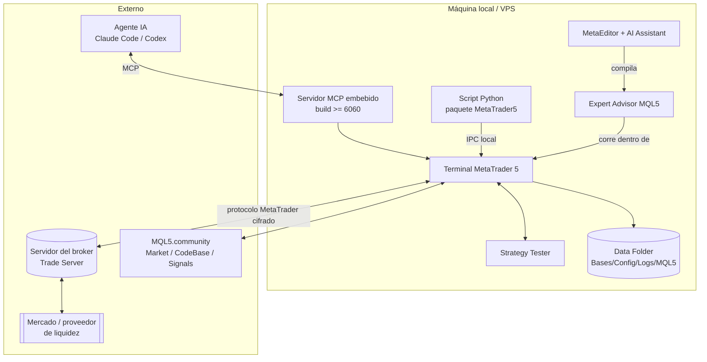

# Arquitectura y funcionamiento de MetaTrader 5

> **Estado:** BORRADOR
> **Última revisión:** 2026-08-07

## 1. Build vigente [VERIFICADO]

A fecha de consulta (07/08/2026), la build de terminal más reciente publicada oficialmente es la **6090 (30/07/2026)**. La build **6060 (23/07/2026)** fue la que introdujo el cambio arquitectónico relevante para este proyecto: soporte nativo de **Model Context Protocol (MCP)** y "AI Assistant" en Terminal y MetaEditor. La 6090 amplió el conjunto de métodos MCP disponibles (añadir indicadores al gráfico, listar indicadores con sus parámetros) y actualizó el paquete Python oficial.

Esto corrige la hipótesis inicial del prompt maestro (que asumía 6060 como la más reciente): el dato de `Web_METATRADER5.md` (build 6090) era el correcto. Ver `PREGUNTAS_ABIERTAS.md` Q-001 sobre cómo tratar este dato de cara a la instalación real.

## 2. Componentes de la plataforma [VERIFICADO]

| Componente | Qué es | Dónde vive |
|---|---|---|
| Terminal MetaTrader 5 | Aplicación cliente: gráficos, Market Watch, ejecución, alojamiento de EAs/indicadores en ejecución | Máquina local (o VPS) |
| MetaEditor | IDE para editar/compilar MQL5 (Experts, indicadores, scripts, librerías); incluye depurador y, desde build 6060, AI Assistant | Máquina local, integrado con el Terminal |
| MQL5 IDE | Denominación conjunta de MetaEditor + Strategy Tester + documentación + MQL5 Wizard | — |
| Strategy Tester | Simulador de estrategias: backtest visual, optimización (exhaustiva y genética), soporta agentes locales/remotos/cloud | Integrado en el Terminal |
| Agentes del tester | Procesos que ejecutan pases de backtest/optimización; pueden ser locales (misma máquina), remotos (otras máquinas propias) o de la MQL5 Cloud Network | Local / red / cloud de terceros |
| Market Watch | Panel de símbolos con cotizaciones en tiempo real y Depth of Market (DOM) | Terminal |
| Gráficos | Hasta 100 simultáneos (versión escritorio), 21 timeframes | Terminal |
| Servidor del broker (Trade Server) | Recibe órdenes, gestiona cuentas, distribuye cotizaciones e histórico | Infraestructura del broker, remota |
| MQL5.community | Portal: documentación, foro, artículos, cuenta única (login IA por defecto desde build 6060) | mql5.com |
| CodeBase | Biblioteca de indicadores/EAs gratuitos descargables | mql5.com, accesible desde el Terminal |
| Market | Tienda de robots/indicadores de pago o gratuitos, +2.000 productos | Integrado en el Terminal |
| Signals | Copy-trading: suscripción a señales de otras cuentas | Integrado en el Terminal |
| Hosting virtual (VPS de MQL5) | Alojamiento del Terminal en la red de MetaQuotes, cerca del servidor del broker | Infraestructura de MetaQuotes |
| Integración Python | Paquete oficial `MetaTrader5` (PyPI) para leer datos y, opcionalmente, operar desde Python | Proceso Python externo al Terminal, requiere el Terminal en ejecución en la misma máquina/red |
| Integración MCP/IA | Servidor MCP embebido en el Terminal (build ≥6060) que expone datos/funciones a agentes externos (Claude Code, Codex, etc.) | Terminal, expuesto vía protocolo MCP |

## 3. Arquitectura cliente-servidor [VERIFICADO] / [DEPENDIENTE DEL BROKER]

```text
EA (MQL5, corre en el Terminal)
   ↓  MqlTradeRequest (OrderSend/OrderSendAsync)
Terminal MT5 (local o VPS)
   ↓  protocolo propietario cifrado MetaTrader
Servidor comercial del broker (Trade Server)
   ↓  conectividad propia del broker (STP/gateway/order book interno, etc.)
mercado / proveedor de liquidez / exchange
```

Lo que ocurre **localmente** (en el Terminal, bajo control del proyecto):

- ejecución del código MQL5 del EA/indicador/script;
- cálculo de indicadores sobre datos ya recibidos;
- decisiones de la estrategia (señal de entrada/salida);
- construcción de la `MqlTradeRequest` y llamada a `OrderSend`/`OrderCheck`;
- registro local de logs, gráficos, `Files`, caché de históricos.

Lo que ocurre **en el servidor del broker** (fuera del control directo del proyecto, `[DEPENDIENTE DEL BROKER]`):

- validación final de la orden (margen, límites, símbolo habilitado);
- decisión real de ejecución (fill, requote, rechazo) y a qué precio;
- generación de deals y actualización de posiciones;
- distribución de cotizaciones (spread, digits, tick size real);
- reglas de servidor: sesiones, swaps, comisiones, filling policies soportadas, netting/hedging.

**Consecuencia de diseño:** el EA nunca debe asumir que lo que decide localmente ("quiero comprar 0.10 lotes a mercado") es lo que ocurrirá exactamente; debe verificar el resultado real vía `MqlTradeResult`/`OnTradeTransaction` (ver `04_Modelo_Trading_Ordenes_Deals_Posiciones.md`).

## 4. Datos [VERIFICADO] / [DEPENDIENTE DEL BROKER]

- **Ticks:** cada actualización de precio bid/ask (y last/volumen si aplica) recibida del servidor. Es el dato más granular disponible.
- **Barras (bars):** agregación OHLC de ticks por periodo. Se construyen a partir del histórico de ticks/quotes que sincroniza el Terminal con el servidor.
- **Timeframes:** MQL5 define **21 timeframes estándar** en `ENUM_TIMEFRAMES` (de M1 a MN1, incluyendo periodos no estándar como M2, M3, M4, M6, M10, M12, M20, H2, H3, H4, H6, H8, H12), más `PERIOD_CURRENT`. [VERIFICADO — mql5.com/en/docs/constants/chartconstants/enum_timeframes]
- **Market Depth (DOM):** profundidad de mercado por símbolo; disponibilidad y niveles reales `[DEPENDIENTE DEL BROKER]` — no todos los símbolos ni todos los brokers la exponen con la misma granularidad.
- **Propiedades de símbolo:** cada símbolo expone propiedades vía `SymbolInfoDouble`/`SymbolInfoInteger` (point, digits, tick size, tick value, contract size, volume step/min/max, stop level, freeze level, filling modes soportados, modo de ejecución, sesiones). Estas propiedades **no son universales**: dependen del broker y deben consultarse en tiempo de ejecución, nunca asumirse (ver `31. INVESTIGACIÓN ESPECÍFICA SOBRE BROKER DEPENDENCY` del prompt maestro, recogido también en `05_Gestion_Riesgo_EAs.md`).
- **Histórico disponible:** profundidad y calidad dependen del broker y del tipo de cuenta; el Terminal descarga histórico bajo demanda y lo cachea localmente en `Bases/<servidor>/history`.
- **Fuente de datos:** siempre el servidor del broker al que está conectado el Terminal — MT5 no mezcla datos de múltiples brokers para un mismo símbolo salvo que el propio broker provea varios feeds.
- **Zona horaria del servidor:** las funciones de tiempo distinguen explícitamente:
  - `TimeCurrent()` → última hora de servidor conocida a partir de la última cotización recibida; no depende del reloj local.
  - `TimeTradeServer()` → hora de servidor calculada localmente a partir del desfase conocido; si el reloj del PC está mal ajustado, puede desviarse.
  - `TimeGMT()` / `TimeLocal()` → hora GMT y hora local del sistema, respectivamente.
  [VERIFICADO — mql5.com/en/docs/dateandtime]. La zona horaria del servidor del broker en sí (offset respecto a GMT, gestión de DST) es `[DEPENDIENTE DEL BROKER]`.
- **Calendario económico:** MT5 incorpora un Economic Calendar nativo con API MQL5 (`Calendar*`), tratado en detalle en `12_Analisis_Fundamental_Noticias_y_Macroeconomia.md`.
- **Noticias de la plataforma:** feed de noticias financieras integrado en el Terminal, con disponibilidad y cobertura `[DEPENDIENTE DEL BROKER]`.

## 5. Data Folder — carpetas y almacenamiento local [VERIFICADO]

Fuente: ayuda oficial del Terminal ("Files and Folders"). Se accede desde MetaEditor con `File → Open Data Folder` o desde el Terminal con `File → Open Data Folder`.

```text
<Data Folder>/
├── Bases/          # bases de datos por servidor: History, Mail, News, Symbols, Trades
├── Config/         # accounts.dat, common.ini, terminal.ini, servers.dat, certificados
├── Logs/           # logs del Terminal y MetaEditor, crash logs (yyyymmdd.log)
├── Profiles/       # perfiles de gráficos, templates, symbol sets, sets de test
├── Tester/         # agentes del tester, logs de tester, caché de optimización
└── MQL5/
    ├── Experts/     # EAs: *.mq5 (fuente) y *.ex5 (compilado)
    ├── Indicators/  # indicadores personalizados
    ├── Scripts/     # scripts
    ├── Include/     # *.mqh comunes (incluye la Standard Library si se referencia así)
    ├── Libraries/   # librerías MQL5 (*.ex5 usados como librería, *.dll si se habilitan)
    ├── Files/       # sandbox de archivos accesible desde FileOpen() (por EA/script)
    ├── Presets/     # *.set — parámetros de arranque de EAs
    ├── Logs/        # logs diarios específicos de EAs
    └── Images/      # *.bmp
```

Implicación para el proyecto: el repositorio Git **no debe vivir dentro del Data Folder real de una instalación de producción**; el flujo de trabajo recomendado (a definir en detalle en `19_Plan_Puesta_en_Marcha.md`) es desarrollar el código fuente en el repositorio y sincronizar/copiar a `MQL5/Experts` (o usar symlink) para compilar, evitando mezclar artefactos generados (`*.ex5`, logs) con el control de versiones.

## 6. Diagrama de arquitectura



## 7. Trazabilidad extremo a extremo (criterio de aceptación)

```text
precio  → llega al Terminal desde el servidor del broker (tick)
       → Market Watch / serie de barras (agregación local)
       → EA (OnTick/OnTimer lee precio y estado, decide señal)
       → orden (MqlTradeRequest vía OrderSend/OrderSendAsync)
       → broker (valida, ejecuta o rechaza; retcode)
       → deal (uno o varios, generados por el servidor)
       → posición (exposición neta o independiente, según netting/hedging)
       → histórico (Bases/<servidor>/Trades, consultable vía HistorySelect)
```

Detalle completo de la parte orden→deal→posición en `04_Modelo_Trading_Ordenes_Deals_Posiciones.md`.

## Fuentes consultadas

- F001, F002, F003 (ver `FUENTES.md`) — build vigente y MCP.
- F006 — "Files and Folders", MetaTrader 5 Help. https://www.metatrader5.com/en/terminal/help/start_advanced/structure — MetaQuotes — OFICIAL — consultado 2026-08-07 — estructura del Data Folder.
- F007 — "Chart Timeframes / ENUM_TIMEFRAMES". https://www.mql5.com/en/docs/constants/chartconstants/enum_timeframes — MetaQuotes/MQL5 — OFICIAL — consultado 2026-08-07 — 21 timeframes estándar.
- F008 — "TimeTradeServer", "TimeCurrent", "TimeGMT" / Date and Time. https://www.mql5.com/en/docs/dateandtime — MetaQuotes/MQL5 — OFICIAL — consultado 2026-08-07 — semántica de hora de servidor vs local.
