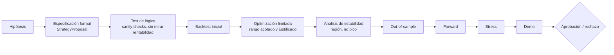

# Metodología quant de validación

> **Estado:** BORRADOR
> **Última revisión:** 2026-08-07
> **Documento crítico.** Su finalidad es impedir que un agente genere un EA, encuentre una curva bonita y lo declare válido. Ninguna estrategia se promociona por opinión de un LLM; se promociona por evidencia reproducible frente a criterios fijados de antemano.

## 1. Backtest — conceptos obligatorios [INFERIDO — consenso quant estándar, no específico de MetaQuotes]

- **In-sample / out-of-sample:** el periodo in-sample es el único que puede usarse para ajustar reglas o parámetros; el out-of-sample (OOS) se reserva y solo se consulta **una vez fijados** la lógica y el rango de parámetros — nunca se itera sobre el OOS.
- **Forward testing:** en MT5, tras una optimización sobre un rango de fechas, el propio Strategy Tester permite reservar un tramo final ("Forward") no usado en la optimización, para una primera confirmación fuera de muestra dentro de la misma herramienta.
- **Walk-forward analysis:** repetir el ciclo optimización(ventana N) → validación(ventana N+1) desplazando la ventana en el tiempo, para comprobar que el resultado no depende de haber elegido "la" ventana de entrenamiento correcta.
  - **Expanding window:** la ventana de entrenamiento crece con cada iteración (siempre desde el inicio).
  - **Rolling window:** la ventana de entrenamiento tiene tamaño fijo y se desplaza (descarta el pasado más antiguo).
  - Ninguna es universalmente mejor: expanding favorece estabilidad a largo plazo pero diluye cambios de régimen recientes; rolling se adapta más rápido pero es más sensible a ruido de muestra pequeña. La elección debe justificarse por estrategia, no fijarse por defecto.
- **Impacto del régimen de mercado:** un resultado positivo en un periodo predominantemente de tendencia no dice nada fiable sobre comportamiento en rango, y viceversa — cruzar contra `RegimeDetectionAgent` (futuro, `11_Arquitectura_Multiagente_Futura.md`) o, como mínimo, documentar manualmente el régimen del periodo probado.
- **Sesgo de supervivencia:** relevante sobre todo si en el futuro se prueban universos de activos (p. ej. acciones que pueden deslistarse); menos crítico en Forex/índices pero debe tenerse presente si se amplía el universo.
- **Look-ahead bias:** uso, aunque sea accidental, de información no disponible en el momento simulado (por ejemplo, indicadores mal calculados en el índice de la serie, o calendario económico consultado sin respetar el momento real de publicación del dato — ver `12_Analisis_Fundamental_Noticias_y_Macroeconomia.md`).
- **Data snooping / múltiples pruebas:** probar muchas variantes hasta que una "funcione" infla la probabilidad de encontrar una casualidad estadística y presentarla como edge. Es el riesgo central cuando el generador de estrategias es un agente de IA capaz de producir variantes rápidamente — tratado en detalle en la sección 9.
- **Leakage:** filtración de información del futuro hacia el pasado por errores de implementación (alineación de timestamps, indicadores calculados sobre la barra en formación en vez de la cerrada, etc.).
- **Optimización excesiva (overfitting) e inestabilidad de parámetros:** un óptimo puntual y aislado en el espacio de parámetros suele ser ruido; una región amplia y estable de buen rendimiento es más creíble que un pico único.
- **Selección de universos:** el criterio para elegir qué símbolos/timeframes probar debe fijarse antes de ver resultados, no después de un barrido exploratorio ad hoc.

## 2. Costes que deben incluirse siempre [VERIFICADO respecto a que el tester los soporta / INFERIDO respecto a la obligación de incluirlos]

Spread, comisión, swap, slippage y, cuando sea relevante (estrategias intradía muy sensibles a timing), latencia. Un backtest sin costes realistas es, en la práctica, una simulación de un mercado que no existe. El Strategy Tester permite configurar comisión y, según el modo elegido, simula spread variable/real y delay — ver `06_Strategy_Tester_y_Datos_Historicos.md` §3.

## 3. Métricas mínimas

| Métrica | Qué mide | Advertencia |
|---|---|---|
| Net Profit | Beneficio absoluto | Sin contexto de riesgo, no dice nada por sí sola |
| Expected Payoff / Expectancy | Beneficio medio esperado por operación | Sensible al tamaño de muestra |
| Profit Factor | Beneficio bruto / pérdida bruta | Puede ser alto con muy pocas operaciones (poco fiable) |
| Sharpe | Retorno ajustado a volatilidad | Asume distribución razonablemente simétrica; penaliza volatilidad al alza igual que a la baja |
| Sortino (si se calcula externamente, p. ej. en Python) | Como Sharpe pero solo penaliza volatilidad a la baja | Más informativo para estrategias con asimetría de retornos |
| Recovery Factor | Beneficio neto / máximo drawdown | Útil para comparar estrategias de perfil similar |
| Max Drawdown | Peor caída de equity desde un máximo | Absoluto; no dice cuánto tiempo se tardó en recuperar |
| Relative Drawdown | Max Drawdown en % sobre el pico | Comparable entre cuentas de tamaño distinto |
| Número de operaciones | Tamaño de muestra | Pocas operaciones = conclusiones poco fiables aunque las métricas se vean bien |
| Win rate | % de operaciones ganadoras | Sin relación con el payoff medio, puede ser engañoso por sí sola |
| Payoff medio ganador/perdedor | Tamaño medio de ganancias vs pérdidas | Junto al win rate da la imagen completa de la expectativa |
| MAE/MFE (si se obtiene) | Adverse/Favorable Excursion máxima por operación | Útil para calibrar SL/TP, no siempre exportado nativamente — puede requerir procesamiento en Python sobre el reporte de deals |
| Estabilidad por periodo | Consistencia mes a mes/trimestre a trimestre | Una curva de equity que depende de 2-3 operaciones "milagro" es frágil |
| Exposición temporal | % del tiempo con posición abierta | Relevante para comparar con benchmark/coste de oportunidad |
| Concentración del PnL | Qué parte del beneficio total proviene de pocas operaciones extremas | Alta concentración = resultado potencialmente accidental, no un edge robusto |

**Ninguna métrica individual es "la verdad".** La decisión de promoción se basa en el conjunto, no en optimizar una sola cifra (y menos aún en el Net Profit aislado).

## 4. Optimización [VERIFICADO]

- **Exhaustive search:** prueba todas las combinaciones del rango — garantiza encontrar el óptimo del espacio definido, pero coste combinatorio alto.
- **Genetic optimization:** algoritmo genético que evoluciona generaciones de combinaciones de parámetros según un criterio de fitness; requiere un criterio de optimización definido (ver siguiente punto) para poder ordenar/seleccionar candidatos entre generaciones.
- **`OnTester()` y criterios de optimización personalizados:** MT5 permite usar como criterio de optimización ("Custom max") el valor `double` devuelto por `OnTester()` en el propio EA, calculado a partir de `TesterStatistics()` u otro cálculo propio — esto permite optimizar por una combinación ponderada de métricas (p. ej. penalizar drawdown y baja frecuencia de operaciones) en vez de un único número nativo como Net Profit.
- **Forward optimization:** ver §1 — tramo reservado tras la optimización, dentro de la misma herramienta del tester.
- **Riesgo de seleccionar el máximo absoluto:** el punto con mejor métrica en el barrido de optimización suele estar sobreajustado al ruido específico de esa ventana de datos.
- **Necesidad de regiones estables:** preferir una zona de parámetros donde el rendimiento se mantiene razonablemente bueno en un entorno amplio de valores vecinos, frente a un pico aislado rodeado de mal rendimiento — esto es señal de robustez frente a pequeñas variaciones de mercado o de implementación.

## 5. Stress testing

| Técnica | Nativo en MT5 | Requiere Python/externo |
|---|---|---|
| Duplicar costes (spread/comisión/slippage) | Sí (reconfigurar parámetros del tester y re-ejecutar) | — |
| Aumentar slippage/deviation | Sí | — |
| Variar parámetros alrededor del elegido | Sí (optimización acotada) | — |
| Desplazar inicio/fin del periodo | Sí (re-ejecutar con fechas distintas) | — |
| Diferentes brokers/datasets | Parcial — requiere cuentas demo en brokers distintos | Sí, para comparar/consolidar resultados |
| Monte Carlo sobre secuencia de operaciones | No de forma nativa | Sí — remuestrear el orden de los trades ya obtenidos para estimar la dispersión de drawdown/equity final |
| Bootstrap | No de forma nativa | Sí — remuestreo con reemplazo sobre retornos por operación |
| Perturbaciones de ejecución (variar aleatoriamente el precio de entrada dentro de un rango realista) | No de forma nativa | Sí — normalmente sobre el log de deals exportado |

**Flujo recomendado [INFERIDO]:** el Strategy Tester genera el reporte de operaciones (exportable a HTML/CSV/XML); Python consume ese reporte para Monte Carlo, bootstrap y comparativas — ver `09_Integracion_Python_MetaTrader5.md`. Python no reemplaza al tester como motor de simulación de mercado; lo complementa como motor de análisis estadístico posterior.

## 6. Protocolo de validación (pipeline)



## 7. Regla crítica: criterios antes de resultados

Los umbrales de aprobación (mínimo de operaciones, Profit Factor mínimo, drawdown máximo tolerado, exigencia de estabilidad, duración mínima de demo, etc.) se fijan **antes de mirar el resultado final** de esa estrategia concreta, y quedan registrados en la propia `StrategyProposal`/`validation_plan` (ver `34.` del prompt maestro y `11_Arquitectura_Multiagente_Futura.md`). Cambiar el umbral después de ver que "casi" lo cumple es exactamente el sesgo de selección que este documento existe para evitar.

## 8. Plantilla `StrategyValidationReport`

```yaml
strategy_validation_report:
  strategy_id:
  version_evaluated:
  evaluated_at:
  evaluated_by:            # agente/persona

  backtest:
    period_in_sample:
    tick_model:             # every_tick_real_ticks | every_tick | m1_ohlc | open_prices
    history_quality_pct:
    broker_dataset:
    costs_included: {spread, commission, swap, slippage}
    metrics: { ... tabla sección 3 ... }

  optimization:
    method:                 # exhaustive | genetic
    criterion:               # nativo o custom (OnTester)
    parameter_ranges:
    stability_region_found: true/false
    selected_parameters:

  out_of_sample:
    period:
    metrics:

  forward:
    period:
    metrics:

  stress_tests:
    - type:
      result:

  demo:
    period_start:
    period_end_expected:
    status:                  # en curso | completado

  acceptance_criteria:       # fijados ANTES de ver resultados
    min_trades:
    min_profit_factor:
    max_drawdown_pct:
    stability_required: true/false

  verdict: PENDIENTE | APROBADA | RECHAZADA
  rationale:
```

## Fuentes consultadas

- F020 — "OnTester" / Event Handling y "Optimization criteria" (MQL5 book). https://www.mql5.com/en/docs/event_handlers/ontester , https://www.mql5.com/en/book/automation/tester/tester_criterion — MetaQuotes/MQL5 — OFICIAL — consultado 2026-08-07 — criterio de optimización personalizado, algoritmo genético.
- Conceptos de walk-forward, look-ahead bias, data snooping, Monte Carlo/bootstrap sobre trades: [INFERIDO] consenso estándar de metodología quant, no específico de un documento oficial de MetaQuotes — se marcan así por transparencia, no porque estén en duda.
