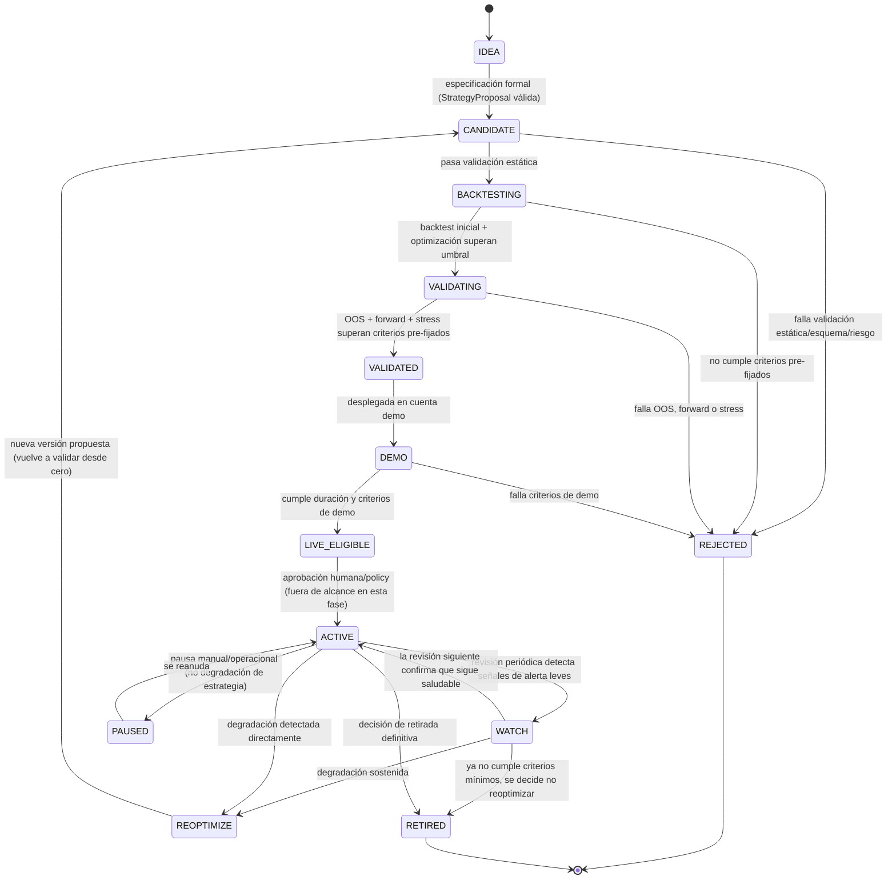

# Ciclo de vida y versionado de estrategias

> **Estado:** BORRADOR
> **Última revisión:** 2026-08-07
> Diseño propio del proyecto [INFERIDO]; no corresponde a un estándar oficial de MetaQuotes.

## 1. Estrategia como entidad versionada

```text
BTC_TrendFollowing_H1
v1.0.0
```

Versionado semántico (`MAYOR.MENOR.PARCHE`) aplicado con criterio propio:

- **MAYOR:** cambio en la hipótesis o en la lógica de entrada/salida — requiere revalidación completa desde backtest.
- **MENOR:** cambio de parámetros optimizables fuera del rango ya validado, o añadir/quitar un filtro — requiere al menos backtest + OOS antes de promover.
- **PARCHE:** corrección de un bug de implementación que no cambia la intención de la estrategia (p. ej. fix de normalización de volumen) — requiere repetir backtest de regresión, no necesariamente todo el pipeline.

## 2. Campos mínimos a registrar por versión

```yaml
strategy_version:
  id:
  name:
  version:
  asset_universe:
  broker_prueba:
  timeframe:
  hypothesis:
  entry_logic_summary:
  exit_logic_summary:
  filters: []
  risk: {ref: RiskPolicy version}
  parameters: {optimizable: [], fixed: []}
  created_at:
  author:                      # persona o agente que la propuso
  code_hash:                   # hash del commit/fuente exacta
  ea_version:                  # versión del binario/EA compilado
  prompt_version:               # si intervino IA en el diseño/código
  backtest_period:
  dataset_broker:
  results: {ref: StrategyValidationReport}
  oos_period:
  forward_period:
  demo_period:
  next_review_date:
```

Todos estos campos alimentan directamente `16_Observabilidad_Auditoria_y_Reproducibilidad.md` — este documento define **qué** se registra; aquel define **cómo** se almacena físicamente.

## 3. Estados propuestos — análisis de la lista del prompt maestro

La lista original (`IDEA, CANDIDATE, BACKTESTING, REJECTED, VALIDATED, DEMO, LIVE_ELIGIBLE, ACTIVE, WATCH, PAUSED, REOPTIMIZE, RETIRED`) se adopta con ajustes: se separa explícitamente la fase de "en optimización/backtesting" de la de "en forward/OOS" (ambas quedaban comprimidas en `BACKTESTING`), y se añade un estado inicial de validación estática previo al backtest, porque un `StrategyProposal` puede rechazarse por razones puramente estructurales (esquema inválido, riesgo mal definido) antes de gastar tiempo de cómputo en backtest.

### Máquina de estados final



**Nota:** en esta fase del proyecto (Fase 0-6 del `ROADMAP.md`), ninguna estrategia puede alcanzar realmente `ACTIVE` con dinero real — el estado `ACTIVE` en el laboratorio equivale como máximo a "EA determinista corriendo en demo de forma continua tras superar `LIVE_ELIGIBLE`", nunca a operar con fondos reales (ver `00_Contexto_y_Objetivos_Proyecto.md` y Fase 7 de `ROADMAP.md`).

## 4. Revisiones periódicas

La cadencia de revisión depende del horizonte de la estrategia:

| Horizonte | Cadencia sugerida de revisión de salud |
|---|---|
| Intradía | Semanal (o tras N operaciones, lo que ocurra antes) |
| Swing (horas-días) | Quincenal/mensual |
| Diario | Mensual |
| Medio plazo (semanas) | Trimestral |

La revisión (`StrategyHealthAgent`, futuro — `11_Arquitectura_Multiagente_Futura.md`) produce uno de estos desenlaces:

```text
HEALTHY     -> sin cambios, sigue en su estado actual
WATCH       -> señales tempranas de degradación, aumentar frecuencia de revisión
REVALIDATE  -> desviación significativa respecto al comportamiento esperado en validación, requiere repetir backtest/OOS con datos recientes
PAUSE       -> detener nuevas entradas sin cerrar posiciones abiertas de forma abrupta (gestión ordenada)
RETIRE      -> retirar definitivamente, documentando la razón
```

**Regla:** una modificación de parámetros significativa (fuera del rango ya validado) genera **nueva versión** (mínimo bump MENOR) y **requiere pasar de nuevo por el pipeline de validación** desde `CANDIDATE` — no hay atajo de "solo cambiar un número" sin repetir evidencia.

## Fuentes consultadas

- Ninguna fuente oficial de MetaQuotes específica: este documento es diseño propio del proyecto [INFERIDO], derivado de los requisitos de las secciones 18 y 35 del prompt maestro y de prácticas estándar de gestión de ciclo de vida de modelos/estrategias cuantitativas.
