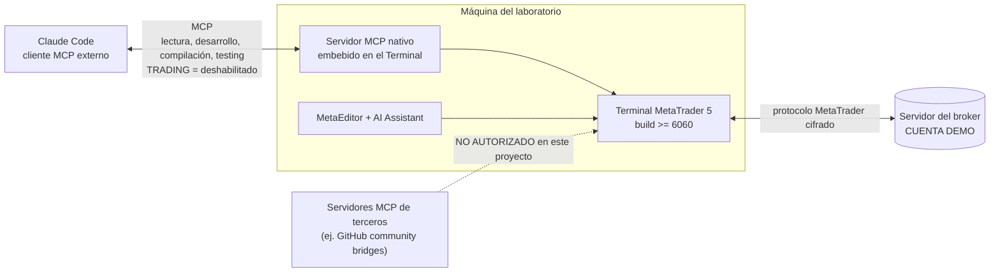

# MCP, IA y agentes en MetaTrader 5

> **Estado:** BORRADOR
> **Última revisión:** 2026-08-07
> **Documento crítico** — bloquea puesta en marcha si queda incompleto o si la distinción de la sección 2 no se entiende bien.

## 1. Verificación oficial de versión/build [VERIFICADO]

- El soporte **nativo** de MCP y "agentic AI" apareció de forma estable en la **build 6060 (23/07/2026)**. Hay evidencia de una beta anterior (build 5955) que ya lo introducía en fase de pruebas — el hito relevante para planificación es la 6060 como primera build estable con esta capacidad.
- La build **6090 (30/07/2026)**, vigente a fecha de esta investigación, amplió el conjunto de métodos MCP disponibles para el AI Assistant (añadir indicadores al gráfico, listar indicadores con parámetros) y no modificó el modelo de permisos.

## 2. Distinción crítica: MCP nativo de MetaQuotes vs. servidores MCP de terceros [VERIFICADO]

Existen **dos cosas distintas** que aparecen mezcladas en búsquedas genéricas sobre "MetaTrader 5 MCP", y confundirlas es un riesgo de seguridad real:

### 2.1 MCP nativo (oficial, integrado en el Terminal desde build ≥6060)

- Servidor MCP **embebido en el propio Terminal/MetaEditor** de MetaQuotes.
- Expone datos de mercado, gráficos, desarrollo/compilación/testing de MQL5 y, si se autoriza explícitamente, capacidades de trading.
- Incluye **controles de seguridad nativos y configurables**: permitir/prohibir trading iniciado por IA (o exigir confirmación manual), y permisos separados para acceso a red y a línea de comandos (F002).
- Se conecta con clientes MCP externos compatibles, mencionando explícitamente **OpenAI Codex y Claude Code**.

### 2.2 Servidores MCP de terceros/comunidad (no oficiales, independientes de MetaQuotes)

Durante la investigación se han encontrado varios proyectos de código abierto (por ejemplo, en GitHub: `ariadng/metatrader-mcp-server`, `Qoyyuum/mcp-metatrader5-server`) que **no son de MetaQuotes**: son puentes construidos por terceros en Python sobre el paquete oficial `MetaTrader5` (ver `09_Integracion_Python_MetaTrader5.md`), expuestos como servidor MCP mediante librerías como `fastmcp`. Existían **antes** de que MetaQuotes lanzara su propio MCP nativo, y siguen publicados de forma independiente.

**Hallazgo de seguridad relevante:** al menos uno de estos servidores de terceros ha sido descrito, en su propia documentación, como que **ejecuta operaciones inmediatamente cuando se solicitan, sin confirmación adicional** ("executes trades immediately when requested, with no extra confirmation needed"). Esto es exactamente el antipatrón que este proyecto prohíbe (Sección 3 y 5.3 del prompt maestro). No hay garantía de que estos proyectos de terceros implementen ningún control equivalente al modelo de permisos nativo de MetaQuotes.

**Regla del proyecto:** para este laboratorio se usará **exclusivamente el MCP nativo integrado en el Terminal** (sección 2.1). Cualquier servidor MCP de terceros que envuelva `order_send` queda **fuera de alcance y no autorizado**, salvo evaluación de seguridad específica y explícita que no se ha hecho en esta fase. Esto se registra también como regla en `15_Seguridad_Credenciales_y_Permisos.md`.

## 3. Cómo se habilita el MCP nativo [VERIFICADO] / [PENDIENTE]

- **Activación básica:** iniciar sesión en el Terminal con una cuenta de **MQL5.community**; tras actualizar a build ≥6060, la plataforma configura automáticamente MQL5.community como proveedor de IA por defecto con una API key del plan gratuito "MQL5 Lite" (F002).
- **Proveedor propio (opcional):** es posible configurar API keys propias para OpenAI, Anthropic, Gemini, DeepSeek, Ollama u otros proveedores soportados, y elegir modelo, "directamente en la configuración del terminal" (F002). La ruta exacta de menú (p. ej. `Tools → Options → AI` o equivalente) **no se ha podido verificar con una fuente que muestre la interfaz real** — queda `[PENDIENTE]`, a confirmar en el Paso de instalación real (`19_Plan_Puesta_en_Marcha.md`).
- **Ajustes de seguridad** (trading por IA, confirmación manual, red, línea de comandos): confirmados como existentes (F002) pero su ubicación exacta en la UI y sus valores por defecto tras una instalación limpia también quedan `[PENDIENTE]` de verificación práctica.

## 4. Cómo se conectan Claude Code y Codex [VERIFICADO] / [PENDIENTE]

- MetaQuotes confirma explícitamente la compatibilidad con **Claude Code** y **OpenAI Codex** como "sistemas externos que soportan MCP" conectables al servidor nativo (F002).
- El mecanismo exacto (¿el Terminal actúa como servidor MCP al que Claude Code se conecta como cliente, con qué transporte — stdio/HTTP/SSE, y con qué configuración concreta en el lado de Claude Code?) no se ha podido confirmar con el nivel de detalle de una guía oficial paso a paso; los artículos encontrados con detalle de configuración concreta corresponden a los puentes **de terceros** de la sección 2.2, no al MCP nativo. **Esto queda registrado como pregunta abierta bloqueante para el detalle de conexión (no para el principio de seguridad), ver `PREGUNTAS_ABIERTAS.md` Q-004.**

## 5. Capacidades expuestas al agente (según lo verificado) [VERIFICADO] / [DEPENDIENTE DEL BROKER]

| Capacidad | Estado |
|---|---|
| Análisis de mercado y de actividad de trading | Confirmado (F002) |
| Desarrollo de aplicaciones MQL5, explicación de código, detección de errores | Confirmado (F002) |
| Compilación | Implícito en "develop and test Expert Advisors with the assistance of AI" (F002) |
| Testing | Idem — soporte para trabajar con Strategy Tester asistido por IA |
| Añadir indicadores al gráfico, listar indicadores disponibles | Confirmado explícitamente en changelog de build 6090 (F003) |
| Trading | Existe la capacidad técnica, **gobernada por el permiso "AI-initiated trading operations"**, que este proyecto mantiene deshabilitado (ver sección 6) |
| Comandos del sistema | Existe un permiso separado de "command line operations" — su alcance exacto (qué comandos, con qué sandboxing) es `[PENDIENTE]` |
| Red | Existe un permiso separado de "network requests" — alcance exacto `[PENDIENTE]` |
| Confirmaciones | El modelo permite exigir confirmación manual como alternativa intermedia entre "permitido" y "prohibido" para trading iniciado por IA |

## 6. Configuración de seguridad objetivo para el laboratorio

```text
Agente puede leer datos                 = SÍ
Agente puede analizar                   = SÍ
Agente puede trabajar con código MQL5   = SÍ
Agente puede compilar/testear            = SÍ
Agente puede usar red si es necesario   = SOLO SI SE JUSTIFICA (evaluar caso por caso, no por defecto)
Agente puede ejecutar comandos          = CONTROLADO (evitar mientras no se audite el alcance exacto)
Agente puede operar cuenta real         = NO
AI-initiated trading (build >=6060)      = DESHABILITADO
Servidores MCP de terceros no auditados = NO AUTORIZADOS
```

Esto es coherente con `REAL TRADING = DESHABILITADO` / `AI TRADING PERMISSION = DESHABILITADO` / `ENTORNO INICIAL = DEMO` (regla 5.3 del prompt maestro), y se traslada a checklist operativa en `15_Seguridad_Credenciales_y_Permisos.md`.

## 7. Diferencia entre las cuatro formas de "IA en MT5"

| Vía | Qué es | Puede operar directamente | Usada en este proyecto |
|---|---|---|---|
| AI Assistant integrado (Terminal/MetaEditor) | Chat/asistente embebido que usa el proveedor de IA configurado | Sí, si el permiso lo autoriza | Sí, para desarrollo/análisis; sin permiso de trading |
| Proveedor LLM configurado en MT5 (MQL5.community por defecto o API propia) | El modelo que responde al AI Assistant y al servidor MCP nativo | N/A (es el backend del punto anterior) | Sí (MQL5.community por defecto en el laboratorio, ver `PREGUNTAS_ABIERTAS.md` Q-002) |
| Cliente MCP externo (Claude Code, Codex) conectado al MCP nativo del Terminal | Un agente externo que consume las capacidades expuestas por el Terminal vía MCP | Sí, si el permiso lo autoriza | Sí — esta es la vía principal de este proyecto para que Claude Code trabaje con MT5 |
| Automatización propia externa (scripts Python, futuros agentes multiagente) | Código propio del proyecto que usa el paquete `MetaTrader5` o llama a Claude/Anthropic API directamente | Sí, técnicamente (`order_send`) | Solo para research/orquestación, nunca como ejecución continua desatendida (ver `09_Integracion_Python_MetaTrader5.md`) |

No son equivalentes: la primera y la tercera comparten el mismo motor de permisos nativo del Terminal; la cuarta vive completamente fuera de ese modelo de permisos y depende enteramente de la disciplina del código propio del proyecto.

## 8. Diagrama de conexión previsto para el laboratorio



## Fuentes consultadas

- F002, F003 (ver `FUENTES.md`) — MCP nativo, permisos, proveedor por defecto.
- F022 — GitHub `ariadng/metatrader-mcp-server`. https://github.com/ariadng/metatrader-mcp-server — Proyecto de comunidad (autor independiente) — COMUNIDAD — consultado 2026-08-07 — ejemplo de puente MCP de terceros, no oficial.
- F023 — "How to connect AI agents to MetaTrader 5 via MCP", MQL5 Articles. https://www.mql5.com/en/articles/21905 — autor de la comunidad MQL5 (artículo de usuario, no documentación oficial de producto) — SECUNDARIA — consultado 2026-08-07 — confirma que describe un puente de terceros, no el MCP nativo del Terminal.
- Búsqueda específica de la ruta de menú exacta para configurar proveedor/API key/permisos de IA en el Terminal: sin fuente oficial con suficiente detalle visual — ver `PREGUNTAS_ABIERTAS.md` Q-004.
