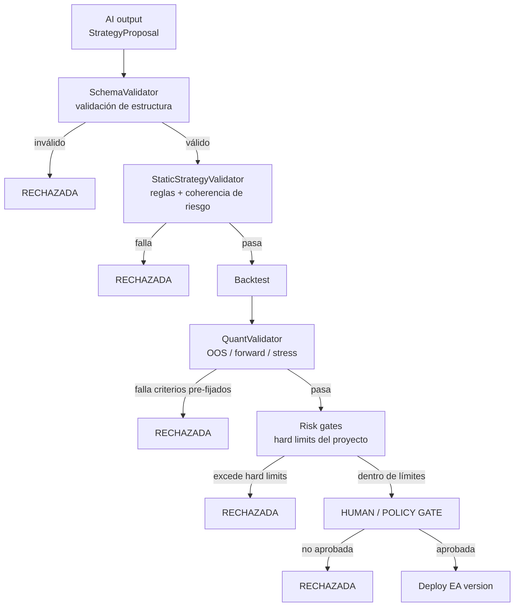

# Arquitectura multiagente futura

> **Estado:** BORRADOR
> **Última revisión:** 2026-08-07
> Diseño conceptual, no implementación. No se construye en esta fase; se documenta para no cerrar puertas en el futuro (Fase 6 del `ROADMAP.md`).

## 1. Principio: extensible por roles, no cadena fija

El flujo del prompt maestro (§2) enumera pasos, pero la arquitectura no debe implementarse como una tubería rígida de exactamente N agentes en un orden fijo. Se diseña como un conjunto de **roles/capabilities** que producen y consumen **artefactos estructurados**, de forma que añadir un agente nuevo (o quitar uno) no rompa el resto del sistema — el contrato es el formato del artefacto, no la identidad del agente que lo produjo.

## 2. Roles analizados

| Agente | Entrada | Salida | Puede operar directamente | Notas de diseño |
|---|---|---|---|---|
| `MarketScannerAgent` | Universo de símbolos, criterios de cribado | Lista de candidatos con justificación breve | No | Primer filtro, barato de ejecutar con frecuencia |
| `TechnicalAnalystAgent` | Símbolo/timeframe | Análisis de tendencia/momentum/volatilidad/estructura/niveles/volumen | No | Puede alimentar a `StrategyDesignerAgent` o a `RegimeDetectionAgent` |
| `FundamentalAnalystAgent` | Símbolo/activo, contexto macro | Evaluación fundamental | No | Complementario al técnico, no sustituto |
| `NewsAndMacroAgent` | Calendario económico + fuentes externas | Evento estructurado (ver `12_Analisis_Fundamental_Noticias_y_Macroeconomia.md`) | **No, nunca** | Su salida es contexto, no una orden — regla explícita del prompt maestro |
| `RegimeDetectionAgent` | Serie de precios/indicadores | Clasificación de régimen (trending/ranging/high-vol/low-vol/risk-on/risk-off/excepcional) | No | Útil como filtro de contexto para validación (`07_Backtesting...` §1) |
| `StrategyDesignerAgent` | Hipótesis + análisis previos | `StrategyProposal` formal (esquema §5) | No | No se acepta una estrategia descrita solo en lenguaje natural — debe traducirse a reglas explícitas |
| `RiskReviewerAgent` | `StrategyProposal` | `RiskReview` (crítica de supuestos) | No | Crítica argumentos de riesgo; no sustituye al `RiskManager` determinista del EA |
| `QuantValidatorAgent` | `StrategyProposal` aprobada estáticamente | `ValidationReport` (orquesta backtest/OOS/forward/stress) | No (orquesta, no decide) | Ejecuta el pipeline de `07_Backtesting_Optimizacion_y_Validacion_Quant.md`, no inventa criterios sobre la marcha |
| `MQLDeveloperAgent` | `StrategyProposal` validada | Código MQL5 (EA) | No | Sigue el estándar de `17_Estandar_Desarrollo_EAs_con_IA.md` |
| `CodeReviewerAgent` | Código MQL5 | `CodeReview` (errores, look-ahead, estado, ejecución, sizing, duplicación, Magic Number, manejo de errores) | No | Gate de calidad antes de compilar/testear en serio |
| `TestOrchestratorAgent` | EA compilado + plan de pruebas | Resultados + artefactos conservados | No | Ejecuta la matriz de test, no decide aprobación |
| `PortfolioRiskAgent` | Conjunto de estrategias activas/candidatas | Evaluación de correlación/concentración | No | Cubre el "riesgo de cartera" que un único `RiskManager` de EA no ve (`05_Gestion_Riesgo_EAs.md` §2) |
| `StrategyHealthAgent` | Estrategias `ACTIVE`/`WATCH` + resultados recientes | `HealthReview` (HEALTHY/WATCH/REVALIDATE/PAUSE/RETIRE) | No | No mira cada tick; revisa periódicamente según la cadencia de `08_Ciclo_Vida_y_Versionado_Estrategias.md` §4 |

Ningún agente de esta lista tiene autorización de trading directo. La única pieza del sistema con esa capacidad es el EA determinista, y solo tras superar el gate de la sección 4.

## 3. Artefactos estructurados (no conversaciones efímeras)

```text
MarketThesis        # salida de scanner/técnico/fundamental/regime combinados
StrategyProposal      # esquema formal, ver sección 5
RiskReview             # crítica estructurada de RiskReviewerAgent
BacktestPlan            # plan de pruebas antes de ejecutarlo (criterios fijados de antemano)
ValidationReport          # = StrategyValidationReport de 07_Backtesting...
CodeReview                 # hallazgos de CodeReviewerAgent
StrategyVersion              # = strategy_version de 08_Ciclo_Vida...
HealthReview                  # salida de StrategyHealthAgent
```

**Formato [INFERIDO]:** se recomienda **YAML** como formato canónico legible por humanos y agentes para artefactos que se versionan junto al código (`StrategyProposal`, `StrategyVersion`), y **JSON Schema** como contrato de validación formal de esos mismos artefactos (para que `SchemaValidator`, sección 4, pueda rechazar mecánicamente un artefacto mal formado antes de que llegue a ningún LLM revisor). No se implementa en esta fase — es una recomendación para cuando se construya el sistema multiagente real.

## 4. Gate determinista de promoción



**Principio explícito:** la aprobación narrativa de otro LLM (por ejemplo, un `RiskReviewerAgent` diciendo "esto parece razonable") **no es una puerta suficiente** en ningún punto de este diagrama. Cada rombo de decisión se resuelve con evidencia verificable (esquema válido, reglas estáticas, métricas cuantitativas contra umbrales pre-fijados, límites duros de código) — el único punto donde interviene juicio humano/policy explícitamente es el `HUMAN / POLICY GATE` final, y ese paso queda fuera de alcance de automatización en esta fase.

## 5. Esquema de `StrategyProposal` (referencia)

Ver plantilla completa en la sección 34 del prompt maestro (`Promp_InicioMetaTrader_Investigar.md`), adoptada como punto de partida y no como forma final. Este documento no la repite íntegra para evitar duplicación (regla de "no repetir secciones enteras" — `40. CALIDAD DOCUMENTAL`); se referencia también desde `08_Ciclo_Vida_y_Versionado_Estrategias.md` (campo `strategy_version`) y `07_Backtesting_Optimizacion_y_Validacion_Quant.md` (campo `validation_plan`, cuyos criterios de aceptación deben fijarse dentro de la propia propuesta, antes del backtest).

## 6. Por qué no se implementa ahora

Construir estos agentes reales requiere: (a) el pipeline determinista de validación ya funcionando con datos reales de backtest (Fase 3 del `ROADMAP.md`), y (b) al menos un EA real corriendo en demo para tener telemetría que un `StrategyHealthAgent` pueda revisar. Implementar el andamiaje multiagente antes de tener ambas cosas produciría agentes que orquestan un vacío. La Fase 0 (esta) fija el contrato (roles, artefactos, gate) para que la Fase 6 no tenga que rediseñarlo desde cero.

## Fuentes consultadas

- Ninguna fuente externa específica: diseño propio [INFERIDO] derivado directamente de las secciones 21, 34 y 35 del prompt maestro, con las decisiones de formato (YAML/JSON Schema) marcadas explícitamente como recomendación de diseño y no como hecho verificado.
