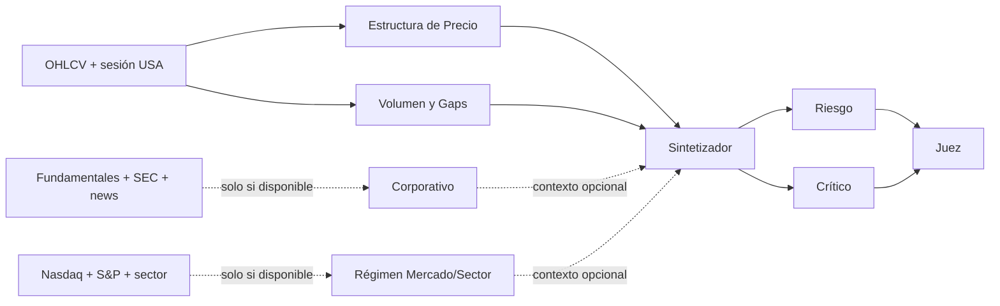

# Configuración ACCIONES — `stocks_v1`

Activo de referencia: `TSLA`; timeframe base: `H1`; id persistente: `baseline-acciones-stocks-v1`; estado: **VALIDATED en simulación funcional**; validación con modelos reales: ver [`VALIDACION_REAL_ACCIONES.md`](VALIDACION_REAL_ACCIONES.md) (🟡 `EN_VALIDACION`, bloque mínimo completado, sin quórum ni GO — pendiente de afinado en vivo).

Véanse la [auditoría](AUDITORIA_MULTIAGENTE.md), [validation loop](VALIDATION_LOOP.md), [estado final](ESTADO_FINAL_CONFIGURACIONES.md) y la [validación real](VALIDACION_REAL_ACCIONES.md). La fuente ejecutable y los prompts completos están en `trading-agents-dashboard/server/src/config/baselinePresets.ts`.

## Grafo

Esta configuración no contiene especialista BCE/Fed ni sesiones Forex. El efecto de tipos solo debe entrar mediante un feed macro/benchmark verificable futuro, no por memoria del modelo.

## Agentes y contratos

| Nombre/id | Responsabilidad | Inputs → outputs; herramientas | Anteriores → posteriores | Activación / abstención | Peso; intervención |
|---|---|---|---|---|---|
| Estructura Acciones / `stock-structure` | Tendencia, niveles y riesgo técnico de gap | snapshot+OHLCV → `AgentAnalysis`; snapshot/OHLCV | ninguno → strategy | Solo con ambos datos | 0.20; specialist |
| Volumen y Gaps / `stock-volume-gap` | Volumen relativo, gap y rango calculados | OHLCV → `AgentAnalysis`; OHLCV | ninguno → strategy | Solo con OHLCV | 0.20; specialist |
| Fundamental Corporativo / `stock-corporate` | Earnings, guidance, valoración y filings | fundamentales+SEC+news → `AgentAnalysis`; feeds verificados | ninguno → strategy opcional | Solo con las tres capacidades | 0.10; specialist opcional |
| Régimen Mercado/Sector / `stock-market-regime` | Contrasta TSLA con Nasdaq, S&P y sector | benchmarks → `AgentAnalysis`; benchmark feed | ninguno → strategy opcional | Solo con benchmarks | 0.10; specialist opcional |
| Sintetizador / `stock-strategy` | Hipótesis mecánica propia de acciones | especialistas+snapshot → `StrategyProposalLite` | estructura+volumen; opcionales corporativo/régimen → revisores | Solo con snapshot y requeridos | 0.25; synthesizer |
| Validador / `stock-risk` | Riesgo determinista, gap y frescura | strategy+snapshot+ancestros → `AgentAnalysis` | strategy → judge | Siempre tras propuesta | 0.20; validator |
| Crítico / `stock-critic` | Detecta dependencia de noticias/filings/benchmarks ausentes | strategy+ancestros → `AgentAnalysis` | strategy → judge | Siempre tras propuesta | 0.15; adversarial |
| Juez / `stock-judge` | Elegibilidad trazable para backtest | revisiones+ancestros → `VerdictResult` | risk+critic → final | Solo con revisiones | 1.00; judge |

## Prompts

Rige el mismo contrato común estructurado: DATO con fuente, INFERENCIA, HIPÓTESIS, CONCLUSIÓN, calidad, confianza, riesgos, invalidaciones y `DATA_NOT_AVAILABLE`; está prohibido inventar noticias, filings, cifras o precios.

- Estructura: usa OHLC, medias, ATR, rango y gap provisto; no traslada horarios Forex.
- Volumen/Gaps: usa exclusivamente volumen relativo, gap y rango; no inventa order flow ni short interest.
- Corporativo: exige fundamentales, earnings/`guidance`, filings, fechas y fuentes; sin feed se abstiene.
- Mercado/Sector: no infiere Nasdaq, S&P ni sector a partir de TSLA.
- Estrategia: considera gaps y horario bursátil; una regla de evento más un filtro máximo; R:R ≥ 1.60 y riesgo ≤ 1%.
- Riesgo: audita gap, frescura, geometría, R:R y ATR; no inventa slippage o liquidez.
- Crítico: busca dependencia indebida de datos corporativos/benchmarks ausentes y sobreconfianza.
- Juez: no descarta blockers sin evidencia; GO solo habilita generación/backtest, nunca capital real.

## Parámetros y carencias

- Modelo: `claude:sonnet`; consenso adversarial con máximo dos revisiones.
- Gate: riesgo ≤ 1%, R:R ≥ 1.60, stop 1.25–2.50 ATR.
- Disponibles: snapshot, OHLCV, sesión, volumen relativo y gap calculado.
- No disponibles: resultados/`guidance`, valoración, SEC, noticias corporativas, Nasdaq/S&P/sector fiables, short interest y order book. Los dos especialistas correspondientes se omiten de forma explícita.

La baseline conserva lo que puede observar de TSLA y no finge análisis fundamental. Incorporar esas fuentes será una ampliación de datos, no un cambio de prompt para “hacer como si” estuvieran disponibles.
