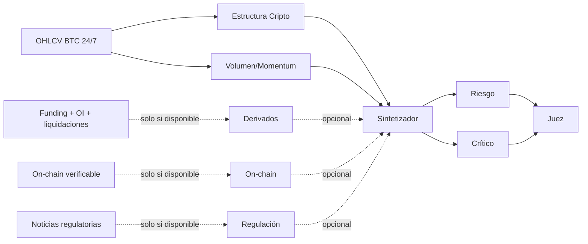

# Configuración CRIPTOMONEDAS — `crypto_v1`

Activo de referencia: `BTC/USD`; timeframe base: `H1`; id persistente: `baseline-criptomonedas-crypto-v1`; estado: **VALIDATED en simulación funcional**.

Véanse la [auditoría](AUDITORIA_MULTIAGENTE.md), [validation loop](VALIDATION_LOOP.md) y [estado final](ESTADO_FINAL_CONFIGURACIONES.md). La fuente ejecutable y los prompts completos están en `trading-agents-dashboard/server/src/config/baselinePresets.ts`.

## Grafo

La sesión es 24/7; no se aplican cierres de Forex ni horario bursátil. Volumen corresponde al venue del feed y nunca se presenta como volumen global.

## Agentes y contratos

| Nombre/id | Responsabilidad | Inputs → outputs; herramientas | Anteriores → posteriores | Activación / abstención | Peso; intervención |
|---|---|---|---|---|---|
| Estructura Cripto / `crypto-structure` | Régimen 24/7 y niveles | snapshot → `AgentAnalysis`; snapshot | ninguno → strategy | Con snapshot | 0.20; specialist |
| Volumen/Momentum / `crypto-volume-momentum` | Volumen relativo, RSI, MACD, Bollinger y ATR | OHLCV → `AgentAnalysis`; OHLCV | ninguno → strategy | Con OHLCV | 0.20; specialist |
| Derivados / `crypto-derivatives` | Funding, OI y liquidaciones | métricas por venue/timestamp → `AgentAnalysis` | ninguno → strategy opcional | Solo con feed | 0.10; specialist opcional |
| On-chain / `crypto-onchain` | Métricas on-chain con definición/altura/fecha | on-chain → `AgentAnalysis` | ninguno → strategy opcional | Solo con feed | 0.10; specialist opcional |
| Regulación / `crypto-regulatory` | Eventos regulatorios verificables | news con source/fetched_at → `AgentAnalysis` | ninguno → strategy opcional | Solo con feed | 0.10; specialist opcional |
| Sintetizador / `crypto-strategy` | Hipótesis mecánica BTC 24/7 | especialistas+snapshot → `StrategyProposalLite` | estructura+volumen; tres opcionales → revisores | Solo con snapshot y requeridos | 0.25; synthesizer |
| Validador / `crypto-risk` | Volatilidad, sizing y riesgo 24/7 | strategy+snapshot+ancestros → `AgentAnalysis` | strategy → judge | Siempre tras propuesta | 0.20; validator |
| Crítico / `crypto-critic` | Refuta dependencia de métricas ausentes y exceso de confianza | strategy+ancestros → `AgentAnalysis` | strategy → judge | Siempre tras propuesta | 0.15; adversarial |
| Juez / `crypto-judge` | Elegibilidad trazable para backtest | revisiones+ancestros → `VerdictResult` | risk+critic → final | Solo con revisiones | 1.00; judge |

## Prompts

Contrato común: separar DATO, INFERENCIA, HIPÓTESIS y CONCLUSIÓN; fuentes explícitas; calidad/confianza; no inventar precios, noticias, derivados u on-chain; `DATA_NOT_AVAILABLE` cuando falte una capacidad.

- Estructura: usa OHLC, medias, rango y ATR bajo régimen 24/7.
- Volumen/Momentum: diferencia el volumen Kraken/venue del volumen global inexistente.
- Derivados: exige venue y timestamp para funding/OI/liquidaciones.
- On-chain: exige fuente, definición y altura/fecha; no acepta narrativa sustituta.
- Regulación: exige noticia provista con `source` y `fetched_at`; memoria del modelo no es noticia actual.
- Estrategia: no presupone funding, liquidaciones u on-chain; evento + un filtro máximo; R:R ≥ 1.60 y riesgo ≤ 1%.
- Riesgo: audita volatilidad elevada, sizing, geometría y ATR bajo operación 24/7.
- Crítico/Juez: cuestionan sobreconfianza y bloquean GO con evidencia insuficiente o blockers pendientes.

## Parámetros y carencias

- Modelo: `claude:sonnet`; máximo dos rondas de corrección.
- Gate: riesgo ≤ 1%, R:R ≥ 1.60, stop 1.25–2.50 ATR.
- Disponibles: BTC/USD OHLCV vía Kraken, snapshot e indicadores, reloj 24/7.
- No disponibles: funding, open interest, liquidaciones, datos on-chain, noticias regulatorias verificadas, dominancia BTC y volumen agregado multi-exchange. Por tanto, los tres agentes opcionales se omiten actualmente con razón verificable.

Macro tradicional y correlación con mercados tradicionales no se incorporan como agentes permanentes porque faltan feeds sincronizados. Podrán añadirse como ramas opcionales cuando exista esa capacidad, manteniendo el mismo contrato de procedencia.
