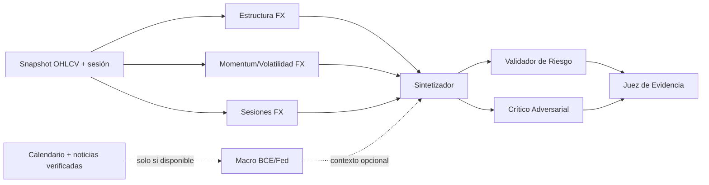

# Configuración FOREX — `forex_v1`

Activo de referencia: `EUR/USD`; timeframe base: `H1`; id persistente: `baseline-forex-forex-v1`; estado: **VALIDATED en simulación funcional**.

Véanse también la [auditoría](AUDITORIA_MULTIAGENTE.md), el [validation loop](VALIDATION_LOOP.md) y el [estado final](ESTADO_FINAL_CONFIGURACIONES.md). La definición ejecutable y los prompts completos son la fuente de verdad en `trading-agents-dashboard/server/src/config/baselinePresets.ts`.

## Grafo

Los tres especialistas técnicos corren en paralelo. Macro es opcional: sin feed verificado se registra `DATA_NOT_AVAILABLE`. Riesgo y crítico revisan en paralelo; el juez no puede emitir GO con blockers sin resolver. Máximo de dos rondas de corrección.

## Agentes y contratos

| Nombre/id | Responsabilidad | Inputs → outputs; herramientas | Anteriores → posteriores | Activación / abstención | Peso; intervención |
|---|---|---|---|---|---|
| Estructura FX / `fx-structure` | Régimen, estructura, niveles e invalidación; no duplica momentum | snapshot → `AgentAnalysis`; snapshot | ninguno → strategy | Con snapshot; abstiene si falta/contradice | 0.20; specialist |
| Momentum y Volatilidad / `fx-momentum-volatility` | RSI, MACD, Bollinger y ATR disponibles | snapshot → `AgentAnalysis`; snapshot | ninguno → strategy | Con snapshot | 0.20; specialist |
| Sesiones FX / `fx-session` | Mercado abierto/cerrado y sesión; nunca finge spread | session clock → `AgentAnalysis`; reloj | ninguno → strategy | Con reloj; abstiene sin reloj | 0.20; specialist |
| Macro BCE/Fed / `fx-macro` | Calendario, bancos centrales y diferencial de tipos | calendario+news → `AgentAnalysis`; feeds verificados | ninguno → strategy opcional | Solo si ambas fuentes existen | 0.10; specialist opcional |
| Sintetizador / `fx-strategy` | Una hipótesis mecánica para backtest | especialistas+snapshot → `StrategyProposalLite`; snapshot | tres requeridos + macro opcional → risk/critic | Solo con snapshot y requeridos | 0.25; synthesizer |
| Validador / `fx-risk` | Audita límites; el gate de código prevalece | strategy+snapshot+ancestros → `AgentAnalysis` | strategy → judge | Siempre tras propuesta | 0.20; validator |
| Crítico / `fx-critic` | Refuta supuestos, contradicciones y macro no verificada | strategy+ancestros → `AgentAnalysis` | strategy → judge | Siempre tras propuesta | 0.15; adversarial |
| Juez / `fx-judge` | Resuelve revisiones y elegibilidad para backtest | risk+critic+ancestros → `VerdictResult` | risk+critic → final | Solo con ambas revisiones | 1.00; judge |

## Prompts

Todos los análisis reciben el contrato común: salida estructurada exclusiva; separar DATO con fuente, INFERENCIA, HIPÓTESIS y CONCLUSIÓN; no inventar precio/noticias/macro; usar `status=data_not_available` y `DATA_NOT_AVAILABLE`; confianza 0..1 y degradación por obsolescencia.

- Estructura: usar OHLC, SMA/EMA y rango; clasificar tendencia primaria y niveles; prohibido afirmar spread/profundidad/liquidez.
- Momentum: usar solo RSI, MACD, Bollinger y ATR calculados; no inferir pendientes ausentes.
- Sesiones: usar exclusivamente el reloj provisto; spread/liquidez ausentes se declaran.
- Macro: exigir feed verificado, `source` y `fetched_at`; memoria del modelo nunca es dato actual.
- Estrategia: una regla de evento y máximo un filtro; solo campos del snapshot; entrada/SL/TP numéricos; R:R ≥ 1.60, riesgo ≤ 1%; sin snapshot/ATR se abstiene.
- Riesgo: recalcular geometría, R:R, porcentaje y ATR; los límites deterministas son vinculantes.
- Crítico: buscar datos ausentes, conflictos, sobreconfianza, sesgo de actualidad y regla no repetible; no contradecir por sistema.
- Juez: GO solo significa “elegible para generar/backtestear”; debe explicar la resolución de cada blocker; `AJUSTAR` solo para bloqueos corregibles y `NO_OPERAR` para contradicción o insuficiencia no corregible.

## Parámetros y fuentes

- Modelo por agente: `claude:sonnet`.
- Consenso: `judge_with_adversarial_review`; conflicto sin resolver impide GO.
- Riesgo determinista: máximo 1% por operación; R:R mínimo 1.60; stop entre 1.25 y 2.50 ATR.
- Disponibles: snapshot, OHLCV y reloj de sesión.
- No disponibles: calendario/noticias verificadas, spread/bid-ask y profundidad. Por ello Macro se omite actualmente; la sesión se usa como control temporal, no como proxy de liquidez.

## Interpretación

Forex sí requiere estructura, momentum/volatilidad, sesión y riesgo siempre. Macro es importante alrededor de BCE, Fed, inflación y empleo, pero solo debe participar cuando existe evidencia verificable. Correlaciones y sentimiento no forman agentes base porque el proyecto no dispone todavía de fuentes fiables; añadirlos al roster permanente induciría narrativa sin datos.
