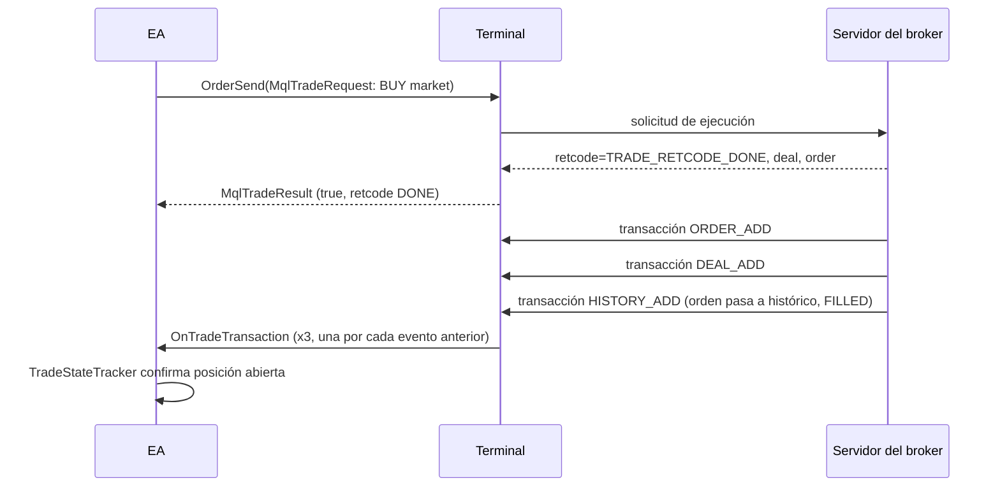
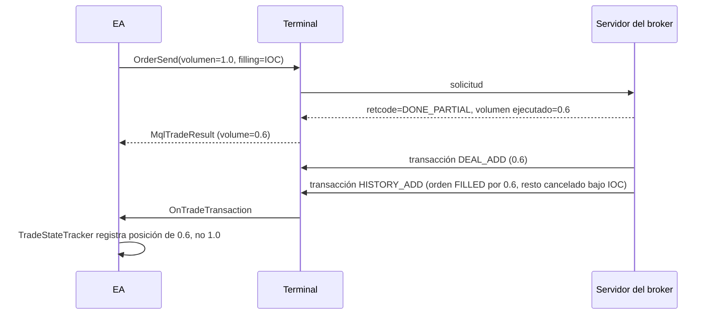
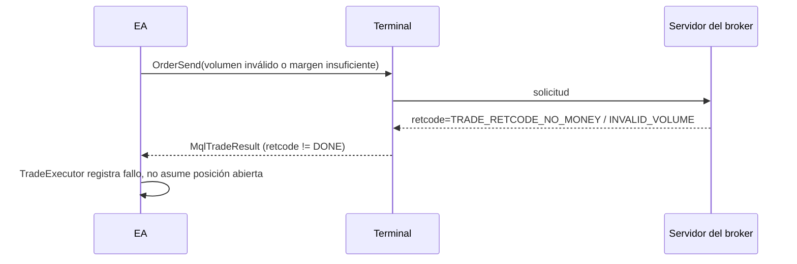
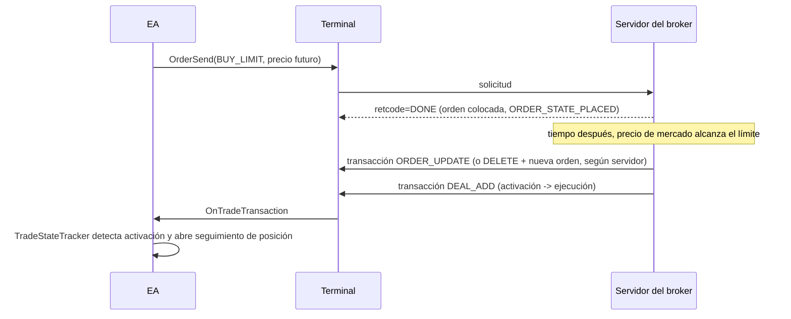
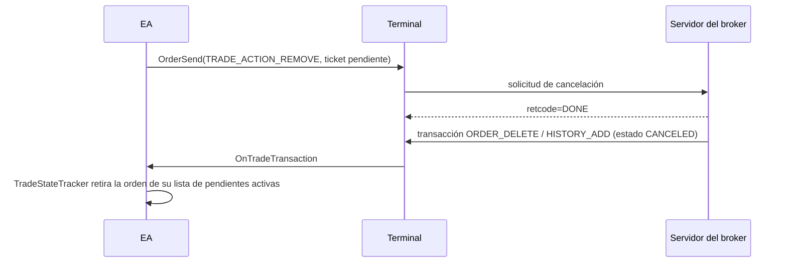
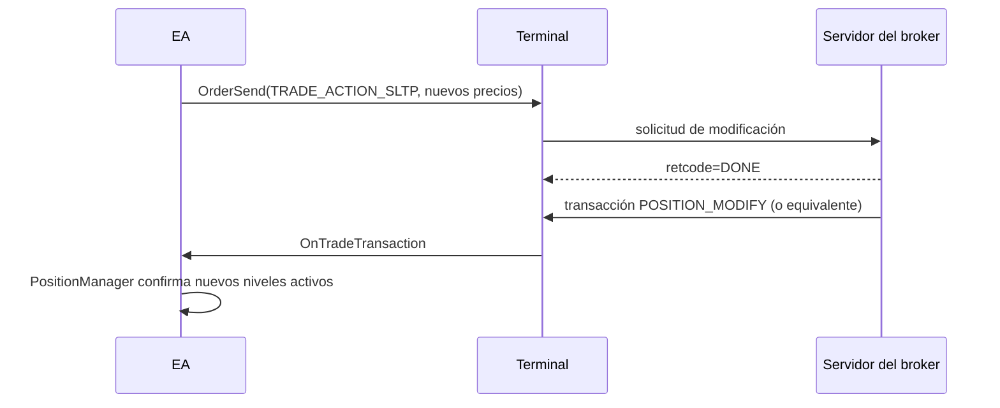
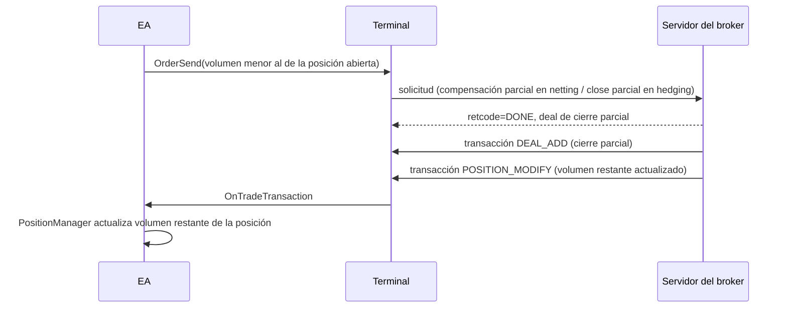

# Modelo de trading: órdenes, deals y posiciones

> **Estado:** BORRADOR
> **Última revisión:** 2026-08-07
> **Documento crítico** — referencia de seguridad del motor de ejecución de los EAs. Bloquea puesta en marcha si queda incompleto.

## 1. `ORDER ≠ DEAL ≠ POSITION` [VERIFICADO]

- **Order (orden):** instrucción enviada al broker (comprar/vender/pendiente) que puede estar activa, ejecutarse, cancelarse o expirar. Se consulta con `OrdersTotal`/`OrderGetTicket` (activas) o `HistoryOrdersTotal`/`HistoryOrderGetTicket` (históricas).
- **Deal (operación/negociación):** el hecho de una ejecución concreta contra el mercado, generado por el servidor del broker. Se consulta con `HistoryDealsTotal`/`HistoryDealGetTicket`.
- **Position (posición):** la exposición neta o individual resultante, según el modo de cuenta (netting u hedging). Se consulta con `PositionsTotal`/`PositionGetTicket`/`PositionSelect`.

**Una orden puede producir uno o varios deals** (ejecución parcial en varios tramos, o una orden de mercado que se ejecuta en más de un "trozo" según liquidez disponible en ese instante) `[DEPENDIENTE DEL BROKER]`. El número exacto de deals por orden depende de la liquidez y de las reglas del servidor.

## 2. Estados de orden — `ENUM_ORDER_STATE` [VERIFICADO]

| Estado | Significado |
|---|---|
| `ORDER_STATE_STARTED` | Orden comprobada por el Terminal, pero todavía no aceptada por el broker |
| `ORDER_STATE_PLACED` | Orden aceptada por el broker (activa) |
| `ORDER_STATE_CANCELED` | Cancelada por el cliente |
| `ORDER_STATE_PARTIAL` | Ejecutada parcialmente (solo aplica a órdenes activas) |
| `ORDER_STATE_FILLED` | Ejecutada por completo (estado final para órdenes históricas) |
| `ORDER_STATE_REJECTED` | Rechazada por el broker |
| `ORDER_STATE_EXPIRED` | Expirada por tiempo de validez (`ORDER_TIME_SPECIFIED`, etc.) |
| `ORDER_STATE_REQUEST_ADD` / `_MODIFY` / `_CANCEL` | Estados transitorios: orden en proceso de ser añadida/modificada/cancelada en el sistema |

Fuente: `ENUM_ORDER_STATE` en la documentación oficial de propiedades de orden (`orderproperties`). Los estados de `REQUEST_*` siguen vigentes en la documentación consultada [VERIFICADO].

## 3. Modos de ejecución [VERIFICADO] / [DEPENDIENTE DEL BROKER]

MT5 define cuatro modos de ejecución a nivel de símbolo/cuenta, configurados por el broker:

| Modo | Comportamiento |
|---|---|
| **Instant Execution** | El Terminal envía la orden al precio mostrado; el broker puede aceptar, rechazar o hacer requote si el precio cambió |
| **Request Execution** | El Terminal solicita un precio al broker antes de confirmar la orden (flujo de dos pasos) |
| **Market Execution** | La orden se envía sin precio fijo; se ejecuta al mejor precio disponible en el momento de procesarse en el servidor (no admite `ORDER_FILLING_RETURN`) |
| **Exchange Execution** | Ejecución contra un libro de órdenes de tipo bolsa/exchange (usado en cuentas de tipo `ACCOUNT_MARGIN_MODE_EXCHANGE`) |

Qué modo aplica a cada símbolo/cuenta es siempre `[DEPENDIENTE DEL BROKER]`; se consulta con `SymbolInfoInteger(symbol, SYMBOL_TRADE_EXECMODE)`.

## 4. Filling policies — `ENUM_ORDER_TYPE_FILLING` [VERIFICADO]

| Política | Comportamiento |
|---|---|
| **FOK (Fill or Kill)** | Se ejecuta el volumen completo solicitado o no se ejecuta nada |
| **IOC (Immediate or Cancel)** | Se ejecuta el volumen disponible en el mercado hasta el límite solicitado; el resto se cancela (no queda pendiente) |
| **RETURN** | Si el volumen no se cubre completamente, el resto **queda como orden pendiente** activa. Es el valor por defecto si no se especifica, y **no está disponible en Market Execution** |
| **BOC (Break Or Cancel)** | Aplicable a órdenes tipo book/bolsa; existe en la enumeración oficial pero su documentación detallada es escasa fuera de contextos de exchange — tratar como `[PENDIENTE]` hasta verificar comportamiento exacto en el broker elegido |

Las políticas disponibles para un símbolo dependen del modo de ejecución y de la configuración del broker (`SYMBOL_FILLING_MODE`) — **nunca asumir que una política concreta está disponible sin consultarla**; es un caso central de la regla de "no codificar supuestos arbitrarios" (`31.` del prompt maestro).

## 5. Netting vs Hedging [VERIFICADO]

`ACCOUNT_MARGIN_MODE` (consultable con `AccountInfoInteger`) tiene tres valores:

- **`ACCOUNT_MARGIN_MODE_RETAIL_NETTING`**: una sola posición neta por símbolo. Para cerrarla (total o parcialmente) se envía una operación **contraria** del mismo símbolo; el servidor la compensa contra la posición existente. No se pueden tener simultáneamente una posición larga y una corta del mismo símbolo.
- **`ACCOUNT_MARGIN_MODE_RETAIL_HEDGING`**: pueden coexistir varias posiciones del mismo símbolo, incluidas direcciones opuestas, cada una identificada por su propio ticket. El cierre se hace explícitamente sobre el ticket de esa posición (comando "Close Position"), no por compensación automática.
- **`ACCOUNT_MARGIN_MODE_EXCHANGE`**: modo de cuentas de tipo bolsa/exchange, con reglas de margen y ejecución propias del mercado regulado correspondiente.

**Implicación de diseño [INFERIDO]:** el `PositionManager` y el `TradeStateTracker` (ver `03_Arquitectura_Expert_Advisors.md`) deben consultar `ACCOUNT_MARGIN_MODE` en `OnInit` y adaptar su lógica de identificación/cierre de posiciones en consecuencia — el mismo EA no puede asumir un único modelo de cierre si se espera que funcione en brokers distintos.

## 6. `OrderSend` y la falsa sensación de certeza [VERIFICADO]

**Un `true` de `OrderSend()` no equivale a una ejecución completada.** `OrderSend` devuelve `true` cuando la solicitud fue **procesada sin error de transporte/validación local**, no cuando el mercado garantiza la ejecución al precio o volumen pedido. Piezas relevantes:

- **`OrderCheck()`**: valida una `MqlTradeRequest` contra los márgenes/reglas disponibles **sin enviarla al servidor** — comprobación previa, no garantía de ejecución posterior.
- **`MqlTradeRequest`**: estructura de la solicitud (acción, símbolo, volumen, precio, SL/TP, tipo de orden, filling, deviation, magic, comment, expiration…).
- **`MqlTradeResult`**: estructura de la respuesta inmediata del servidor a la solicitud (retcode, deal, order, volumen ejecutado, precio, comentario del broker).
- **`retcode`**: código de resultado de trading (p. ej. `TRADE_RETCODE_DONE`, `TRADE_RETCODE_REQUOTE`, `TRADE_RETCODE_REJECT`, `TRADE_RETCODE_NO_MONEY`, etc.) — debe comprobarse siempre, nunca solo el booleano de retorno de `OrderSend`.
- **`retcode_external`**: código adicional que puede devolver el proveedor de liquidez/exchange subyacente cuando el broker lo expone; información complementaria al `retcode` estándar de MetaTrader, `[DEPENDIENTE DEL BROKER]`.
- **`OrderSendAsync()`**: variante asíncrona que no bloquea el hilo del EA a la espera de la respuesta del servidor — la confirmación llega igualmente vía `OnTradeTransaction`, no como valor de retorno directo.
- **`OnTradeTransaction()`**: mecanismo recomendado para conocer el desenlace real (ver `02_Fundamentos_MQL5.md` §4).

**Regla de diseño no negociable:** ningún EA del proyecto debe considerar "abierta" una posición solo porque `OrderSend` devolvió `true`; debe confirmarlo por `OnTradeTransaction` o por consulta directa de `PositionSelect`/`HistoryDealSelect`.

## 7. Diagramas de secuencia (criterio de aceptación)

### 7.1 Market order completamente ejecutada

### 7.2 Ejecución parcial

### 7.3 Rechazo

### 7.4 Pending order activada

### 7.5 Cancelación

### 7.6 Modificación de SL/TP

### 7.7 Cierre parcial

**Nota sobre todos los diagramas:** el número y orden exacto de transacciones (`ORDER_ADD`, `DEAL_ADD`, `HISTORY_ADD`, etc.) que llegan a `OnTradeTransaction` para una misma solicitud es `[DEPENDIENTE DEL BROKER]` y puede variar; lo único garantizado por el modelo de MQL5 es que **no hay correspondencia 1:1** entre una solicitud y un único evento, y que los eventos se procesan secuencialmente en la cola del EA (ver `02_Fundamentos_MQL5.md`). El diseño del `TradeStateTracker` debe ser tolerante a variaciones en el número/orden de eventos, y basarse en el **estado final consultable** (`PositionSelect`, `HistoryDealSelect`) como fuente de verdad de respaldo, no solo en contar eventos.

## Fuentes consultadas

- F013 — "Order Properties" / `ENUM_ORDER_STATE`. https://www.mql5.com/en/docs/constants/tradingconstants/orderproperties — MetaQuotes/MQL5 — OFICIAL — consultado 2026-08-07 — estados de orden.
- F014 — "Order execution modes by price and volume" / "Symbol trading conditions and order execution modes". https://www.mql5.com/en/book/automation/experts/experts_execution_filling , https://www.mql5.com/en/book/automation/symbols/symbols_execution_filling — MetaQuotes/MQL5 — OFICIAL — consultado 2026-08-07 — modos de ejecución y filling policies (FOK/IOC/RETURN).
- F015 — "Account type: netting or hedging" / "Account margin settings". https://www.mql5.com/en/book/automation/account/account_netting_hedge , https://www.mql5.com/en/book/automation/account/account_margin — MetaQuotes/MQL5 — OFICIAL — consultado 2026-08-07 — `ENUM_ACCOUNT_MARGIN_MODE`.
- F011 (ver [`FUENTES.md`](FUENTES.md)) — reutilizada para `OnTradeTransaction`/`ENUM_TRADE_TRANSACTION_TYPE`.
- Sobre BOC: no se ha encontrado documentación oficial detallada equivalente a FOK/IOC/RETURN — queda marcado `[PENDIENTE]` y registrado en [`PREGUNTAS_ABIERTAS.md`](PREGUNTAS_ABIERTAS.md) Q-003.
