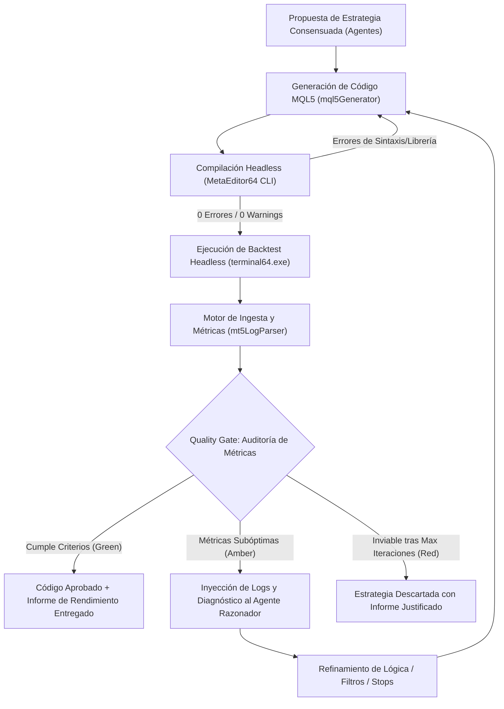

# 20. Pipeline de Validación con Backtest Automatizado e Iteración Agéntica

## 1. Visión y Objetivo

El objetivo fundamental de este pipeline es garantizar que **la plataforma nunca entregue código MQL5 al usuario sin haber sido validado y testeado al 100% de forma autónoma con datos históricos reales**.

Un análisis teórico positivo emitido por el panel de agentes (Analista Técnico, Fundamental, Gestor de Riesgos, Validador, Refutador y Razonador) es solo una **hipótesis**. La confirmación de viabilidad exige someter el Expert Advisor generado a un **Backtest Headless en MetaTrader 5** antes de declararlo apto para entrega.

Si el bot genera pérdidas, no opera o presenta fallos de ejecución, el sistema activa un **bucle iterativo cerrado de autocorrección agéntica** (Reflexión $\rightarrow$ Ajuste $\rightarrow$ Re-testeo) o, en caso de invalidez de la tesis, descarta formalmente la estrategia.

---

## 2. Arquitectura del Bucle Agéntico Cerrado (Closed-Loop Pipeline)

---

## 3. Fases del Pipeline Automatizado

### Fase 1: Generación y Compilación Headless
1. **Generación:** `mql5Generator.ts` crea el archivo `.mq5` aplicando las directivas del estándar del proyecto (evitar spam de logs, gestión de filling mode, stops relativos en pips).
2. **Compilación:** Se invoca `MetaEditor64.exe /compile:<archivo.mq5> /log:<compile.log>`.
3. **Control:** Si existen errores o warnings, se capturan y se envían de vuelta al LLM con un prompt correctivo (hasta 3 intentos de compilación).

### Fase 2: Ejecución de Backtest Headless
1. **Configuración INI Dinámica:** El servidor genera un archivo `autotester_<id>.ini` especificando:
   * Símbolo (ej. `EURUSD`), Timeframe (ej. `H1`).
   * Rango de fechas histórico (ej. últimos 6 a 12 meses).
   * Modelo de simulación (`Model=0` para Every Tick o `Model=1` para 1-min OHLC rápido).
   * Depósito inicial (ej. $10,000 USD) y apalancamiento (1:100).
   * Reporte de salida y bandera de apagado (`ShutdownTerminal=1`, `Visual=0`).
2. **Ejecución del Terminal:** Se lanza `terminal64.exe /config:autotester_<id>.ini` en un proceso desacoplado y controlado con timeout de seguridad.

### Fase 3: Ingesta y Análisis de Métricas (`mt5LogParser`)
El motor de parseo procesa el log de la prueba y extrae automáticamente:
* **Actividad:** Número de operaciones ejecutadas ($N_{trades}$).
* **Efectividad:** Win Rate ($W\%$), operaciones ganadas por TP vs perdidas por SL.
* **Rentabilidad:** Balance final, beneficio neto (USD y %), Profit Factor ($PF$).
* **Calidad de Gestión:** Ratio Riesgo/Beneficio real ($R:R$) y Esperanza Matemática ($R$ por operación).
* **Alertas de Salud:** Detección de errores `Invalid stops`, `Off quotes`, o falta de fills.

---

## 4. Quality Gate: Criterios Cuantitativos de Aprobación

Para que un Expert Advisor sea considerado **Aprobado** y entregado al usuario, debe superar los siguientes umbrales mínimos:

| Métrica | Umbral Mínimo Exigido | Motivo Técnico |
| :--- | :--- | :--- |
| **Operatividad ($N_{trades}$)** | $\ge 15$ operaciones en 6-12 meses | Evita EAs con condiciones de entrada tan restrictivas que nunca abren órdenes. |
| **Errores de Ejecución** | $0$ órdenes rechazadas | Prohibidos errores como `Invalid stops`, `No money`, `Trade disabled`. |
| **Esperanza Matemática ($E$)** | $> 0.10\text{ R}$ por operación | Garantiza una ventaja estadística real positiva sobre la muestra. |
| **Profit Factor ($PF$)** | $\ge 1.20$ | La ganancia bruta debe superar holgadamente las pérdidas brutas. |
| **Beneficio Neto** | $> 0\text{ USD}$ (Positivo) | El balance final debe superar el depósito inicial en el periodo histórico probado. |
| **Drawdown Máximo** | $\le 15\%$ del Balance | Protección de capital y control estricto de la curva de equidad. |

---

## 5. Protocolo de Iteración y Refinamiento Agéntico

Si el backtest finaliza con **métricas subóptimas o negativas**, el sistema no entrega el código ni se rinde inmediatamente:

### 1. Inyección de Contexto al Agente Razonador
Se construye un payload estructurado con el resultado del backtest:
* Historial de operaciones cerradas y motivos (ej. *"30 SL vs 9 TP"*).
* Diagnóstico de fallos (ej. *"Las posiciones alcanzan +1.2R y se giran a SL completo por falta de Breakeven"* o *"Falsas compras durante fases laterales"*).

**Implementado (2026-08-20).** Hasta entonces el diagnóstico del Quality Gate solo volvía al LLM de código (retocaba SL/TP/filtros dentro de la misma tesis); esta reinyección al propio Agente Razonador — que sí puede reconsiderar indicadores/dirección/condición de entrada — es la que faltaba y motivó una revisión completa del pipeline (agentes dando "GO" a estrategias que luego perdían dinero en backtest real). Detalle técnico: [`server/README.md` §"Cierre del bucle con el panel de agentes cuando el backtest real falla"](../../trading-agents-dashboard/server/README.md#cierre-del-bucle-con-el-panel-de-agentes-cuando-el-backtest-real-falla-srcroutesmql5ts-srcengineorchestratorts).

### 2. Acciones Correctivas del Agente
* **Ajuste de Gatillo (Trigger):** Exigir confirmación por acción del precio en lugar de entrar por simple toque de media móvil.
* **Gestión de Posición:** Incorporar Breakeven dinámico al alcanzar $+1\text{R}$ o Trailing Stop basado en ATR.
* **Filtro de Régimen:** Añadir filtro de fuerza de tendencia (ej. `EMA50 > SMA200` o `ADX > 20`) para evitar rangos.
* **Optimización de SL/TP:** Reajustar la distancia de stops a la volatilidad real (ATR) del símbolo.

### 3. Límite de Iteraciones y Descarte
* **Máximo de Iteraciones:** 3 a 5 ciclos completos de Generación $\rightarrow$ Backtest $\rightarrow$ Análisis.
* **Criterio de Descarte:** Si tras las iteraciones máximas la estrategia no logra generar ventaja estadística positiva en ese par/timeframe, el sistema declara la **Estrategia Descartada**, emite un informe explicativo al usuario y evita que el usuario pierda tiempo probando un bot perdedor.

---

## 6. Integración en el Dashboard y API

1. **Job en Segundo Plano:** El endpoint de generación ejecuta el pipeline de forma asíncrona informando el progreso en vivo mediante Server-Sent Events (SSE):
   * `Estado: Generando código...`
   * `Estado: Compilando en MetaEditor (0 errores)...`
   * `Estado: Ejecutando Backtest histórico (EURUSD H1)...`
   * `Estado: Iteración 1/3 - Ajustando Breakeven tras Win Rate del 23%...`
   * `Estado: Iteración 2/3 - Backtest Exitoso (PF: 1.65, Win Rate: 48%, Profit: +8.4%). Entregando código.`
2. **Tarjeta de Auditoría en la UI:** El usuario recibe el código junto con la ficha técnica del backtest que valida su rentabilidad y robustez estadística.
